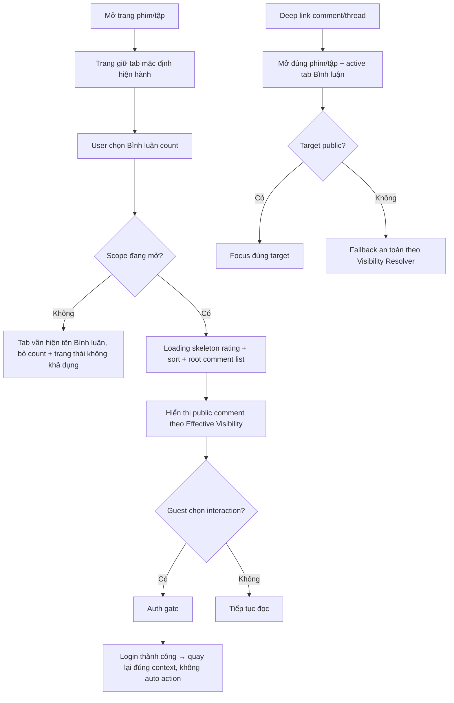

# User Flow — US01 Đọc khu vực bình luận

> User Story: [US01_DOC_KHU_VUC_BINH_LUAN.md](US01_DOC_KHU_VUC_BINH_LUAN.md)

**Platforms:** Phone, Web, SmartTV  
**Actor:** Guest / User đăng nhập

## Flow

## UX đã chốt

- Comment là **tab riêng**. Phim bộ mặc định tab `Danh sách tập`; phim lẻ mặc định tab `Đề xuất`. User chủ động chọn tab Bình luận.
- Tab mở hiển thị `Bình luận ({public_count})`; scope Đóng chỉ hiển thị `Bình luận`.
- Comment dài tối đa **3 dòng** → `Xem thêm` / `Thu gọn`.
- Rời tab rồi quay lại trong cùng phiên: giữ scroll, sort, thread mở, trạng thái expand/collapse; refresh dữ liệu ngầm không reset context.
- Có dữ liệu mới khi đang đọc: không tự chèn; hiện `Có {n} bình luận mới` để user chủ động refresh.
- Guest được đọc public content; login chỉ khi tương tác.
- Empty: logged-in có CTA viết đầu tiên; Guest có CTA login; SmartTV có hướng dẫn + QR chuyển sang smartphone.
- SmartTV không tạo nội dung hay interaction dạng composer/action moderation; vẫn hỗ trợ đọc, Like/Unlike, Rating, Sort, reveal Spoiler và Timestamp seek bằng remote. SmartTV không hỗ trợ Comment, Reply, Mention, Report, Share, Edit hoặc Delete; khi cần các action này hiển thị hướng dẫn + QR chuyển sang smartphone.

## States

Loading skeleton · Empty · Populated · Auth gate · Scope Closed · Target unavailable · Background refresh.
