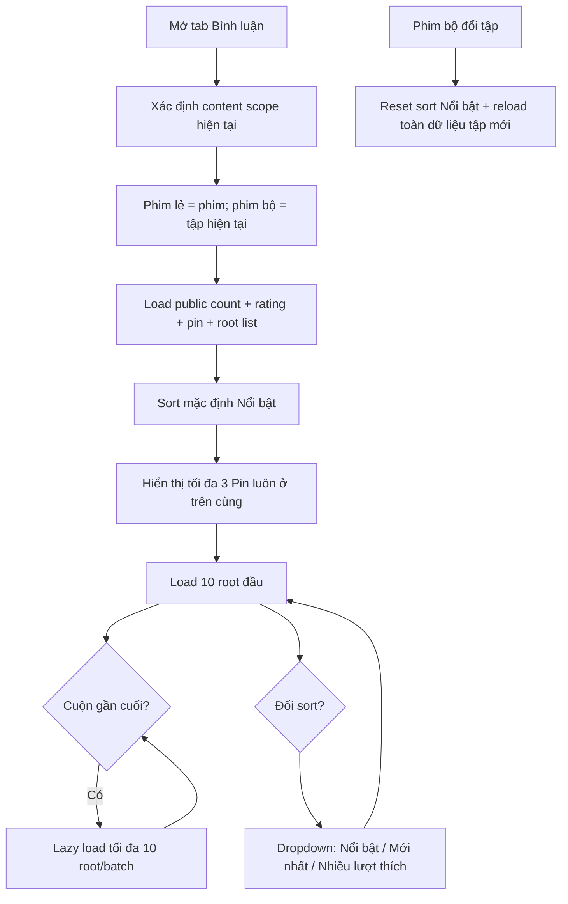

# User Flow — US02 Số lượng và sắp xếp bình luận theo nội dung hiện tại

> User Story legacy filename: [US02_XEM_BINH_LUAN_THEO_SERIES_TAP_SO_LUONG_VA_SAP_XEP.md](US02_XEM_BINH_LUAN_THEO_SERIES_TAP_SO_LUONG_VA_SAP_XEP.md)

**Platforms:** Phone, Web, SmartTV

## Flow

## UX đã chốt

- **Không có scope `Toàn bộ phim/Series` phía người xem.** Phim bộ chỉ có comment của tập hiện tại; phim lẻ ở cấp phim.
- Pin tối đa 3, luôn ở đầu trong mọi sort, có `📌 Đã ghim`, không lặp trong list thường.
- Sort control dạng dropdown `Nổi bật ▼`.
- Root comment lazy load **10/batch**.
- Khi user bấm indicator comment mới: `Nổi bật` và `Nhiều lượt thích` luôn giữ ranking đúng, không ép comment mới lên đầu; `Mới nhất` có thể đưa user tới comment mới đầu tiên.
- SmartTV vẫn được đổi sort bằng remote.

## States

Loading/skeleton · Empty · Loading more · End list · New-content indicator · Sort menu.
