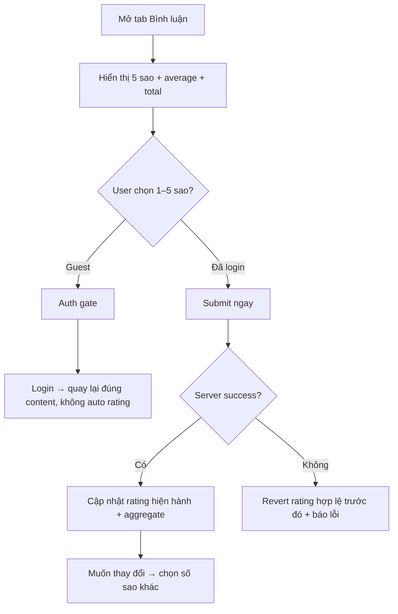

# User Flow — US03 Đánh giá 5 sao

> User Story: [US03_DANH_GIA_SERIES_VA_TAP_PHIM.md](US03_DANH_GIA_SERIES_VA_TAP_PHIM.md)

**Platforms:** Phone, Web, SmartTV

## Flow

## UX/Business đã chốt

- Phim lẻ: rating cấp phim. Phim bộ: rating **chỉ cấp tập hiện tại**; không còn rating Series.
- Một account có 1 rating hiện hành/content scope.
- User **được thay đổi 1–5 sao nhưng không được xóa rating**.
- Chọn sao là submit ngay, không có nút `Gửi đánh giá`.
- Submit lỗi: revert rating cũ, không tự retry.
- SmartTV cho đánh giá bằng remote nếu đã đăng nhập.
- A11y: radiogroup, mỗi option label `{n} sao`.
