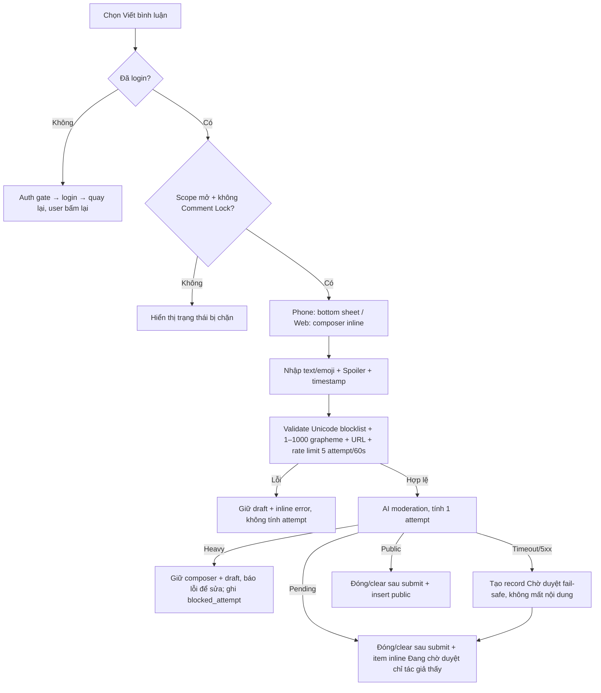

# User Flow — US04 Đăng bình luận

> User Story: [US04_DANG_BINH_LUAN.md](US04_DANG_BINH_LUAN.md)

**Platforms:** Phone, Web. SmartTV không tạo comment.

## Flow

## UX đã chốt

- Phone mở **bottom sheet**; Web expand composer inline.
- Draft tự lưu khi đóng composer nhưng **chỉ trong phiên hiện tại**; đóng app/reload/kết thúc phiên thì draft mất. Submit thành công clear draft.
- Composer hiển thị content context hiện tại.
- Nickname đổi được ở Profile và có shortcut `Đổi nickname` trong composer.
- Nickname AI timeout/5xx/down: **không đổi nickname**, giữ old/fallback, báo thử lại, không Pending, không vào queue, không tiêu quota đổi nickname.
- **Comment/Reply AI timeout/5xx/down thì ngược lại — fail-safe:** record vẫn được tạo ở `Đang chờ duyệt`, không bao giờ tự public. Đây là ngoại lệ có chủ đích so với nickname vì comment là nội dung user vừa soạn.
- Rate limit đếm **attempt** (5/rolling 60 giây/user, dùng chung Comment+Reply): validation fail không tính, nhưng mọi lần đã gọi AI đều tính — kể cả khi bị chặn ở mức Nặng.
- Pending comment hiển thị inline chỉ tác giả với nhãn `Đang chờ duyệt`, không tính public count.
- SmartTV không có nút Viết bình luận; hiển thị hướng dẫn + QR để dùng smartphone.
