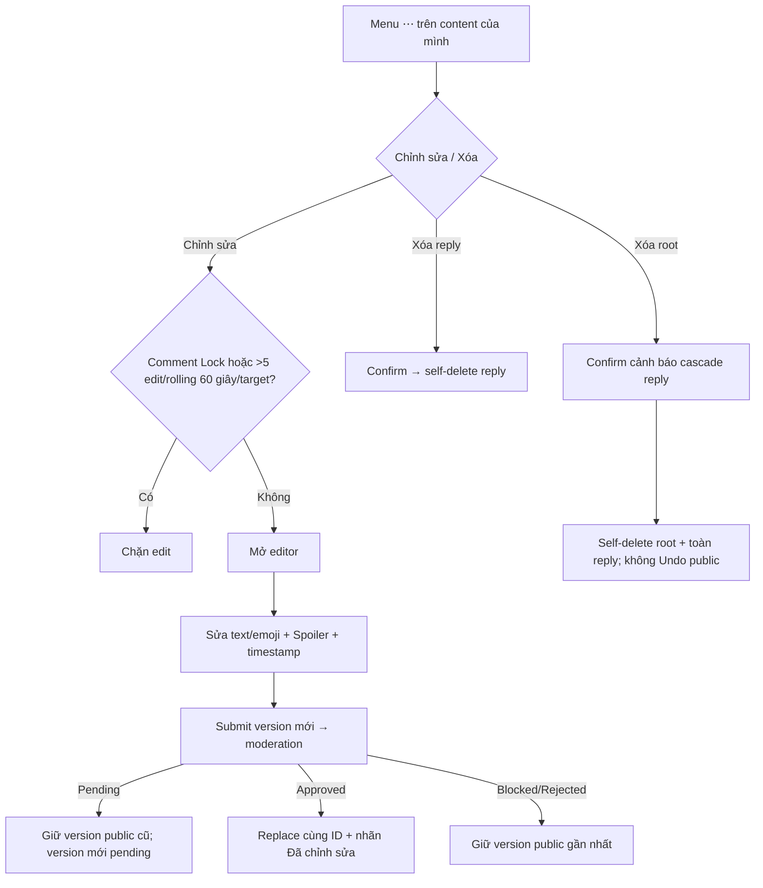

# User Flow — US05 Sửa và xóa bình luận

> User Story: [US05_SUA_VA_XOA_BINH_LUAN.md](US05_SUA_VA_XOA_BINH_LUAN.md)

**Platforms:** Phone, Web

## UX đã chốt

- Action của chính user nằm trong menu `⋯`.
- Edit được sửa toàn bộ text/emoji, Spoiler, timestamp.
- Pending content vẫn được edit; version pending cũ được thay bằng version mới, không tạo nhiều pending song song.
- Edit limit 5/rolling 60 giây/target.
- Self-delete root khác CMS delete; user không có Undo public.
