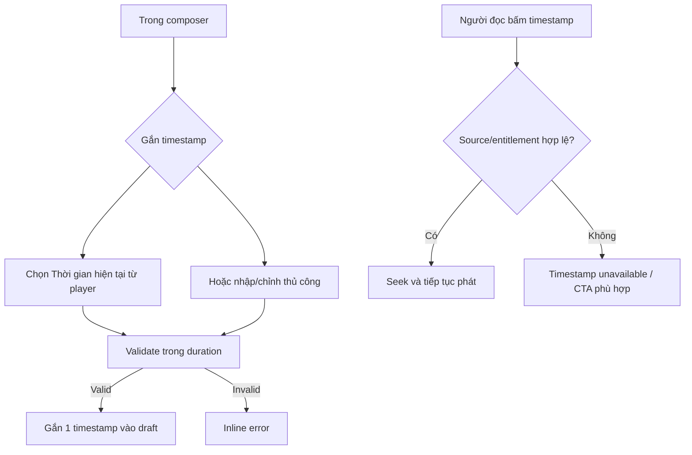

# User Flow — US06 Bình luận kèm mốc thời gian

> User Story: [US06_BINH_LUAN_KEM_CANH_PHIM.md](US06_BINH_LUAN_KEM_CANH_PHIM.md)

**Platforms:** Phone, Web; SmartTV được bấm timestamp để seek.

## UX đã chốt

- Cho cả `Thời gian hiện tại` và nhập tay.
- Dưới 1 giờ: `mm:ss` (vd `12:32`); từ 1 giờ: `hh:mm:ss` (vd `01:12:32`).
- Timestamp phải thuộc phim/tập hiện tại và không vượt duration.
- Edit comment được sửa timestamp.
- SmartTV bấm timestamp bằng remote để seek/phát.
- Share deep link không auto-seek.
