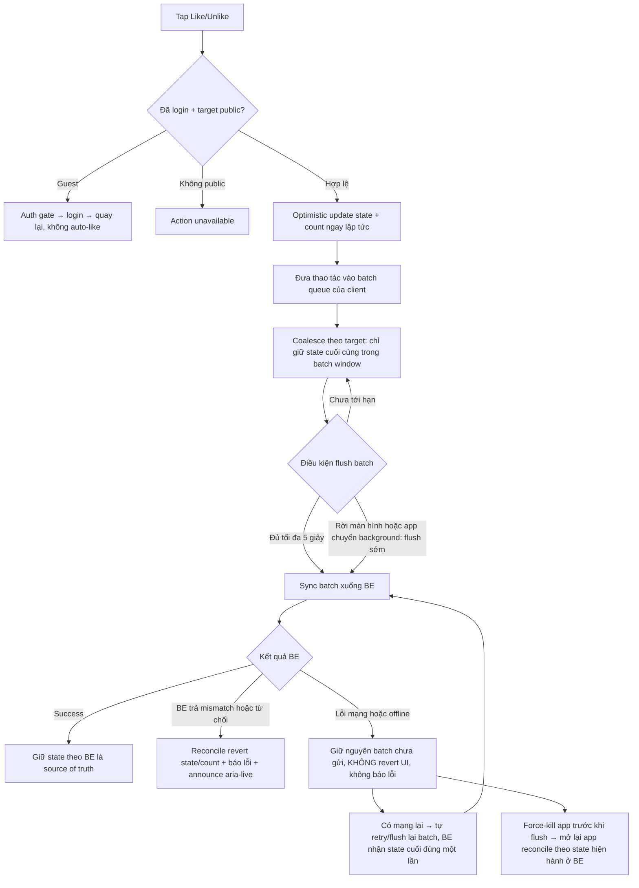

# User Flow — US07 Like / Unlike

> User Story: [US07_LIKE_VA_UNLIKE_BINH_LUAN.md](US07_LIKE_VA_UNLIKE_BINH_LUAN.md)

**Platforms:** Phone, Web, SmartTV

## UX đã chốt

- Hiển thị `👍 {count}` trực tiếp cạnh Like.
- `Dislike` trên SmartTV chỉ có nghĩa **Unlike/bỏ Like**, không có reaction âm riêng.
- **Optimistic update ngay lập tức**, sau đó client **gom batch tối đa 5 giây** rồi mới sync BE, không gửi từng thao tác riêng lẻ tức thì (AC3–AC4).
- **Flush sớm** khi user rời màn hình hoặc app chuyển background trước khi hết 5 giây (AC5).
- Nhiều Like/Unlike liên tiếp trên **cùng một target** trong cùng batch window được **coalesce về state cuối cùng**; các state trung gian không được gửi lên BE và không làm sai Net Like (AC6). BE phải idempotent/dedup để double-click hoặc retry không nhân đôi Like (AC8).
- **Chỉ revert khi BE trả mismatch hoặc từ chối** (AC7): client reconcile về state BE và hiển thị microcopy “Chưa lưu được lượt thích.”
- **Lỗi mạng tạm thời KHÔNG revert UI và không bắn toast lỗi**: batch chưa gửi được giữ lại, client tự retry/flush khi có mạng lại và BE nhận đúng state cuối cùng đúng một lần (TC-US07-014a). Nếu app bị force-kill trước khi flush, lần mở lại UI reconcile theo state hiện hành trên BE thay vì giữ optimistic state đã mất (TC-US07-014b).
- SmartTV cho Like/Unlike bằng remote nhưng vẫn yêu cầu login.
