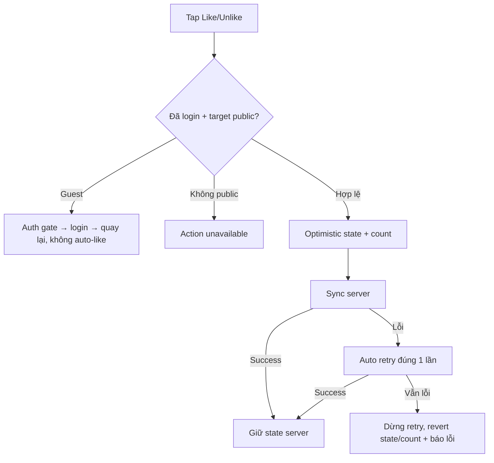

# User Flow — US07 Like / Unlike

> User Story: [US07_LIKE_VA_UNLIKE_BINH_LUAN.md](US07_LIKE_VA_UNLIKE_BINH_LUAN.md)

**Platforms:** Phone, Web, SmartTV

## UX đã chốt

- Hiển thị `👍 {count}` trực tiếp cạnh Like.
- `Dislike` trên SmartTV chỉ có nghĩa **Unlike/bỏ Like**, không có reaction âm riêng.
- Request lỗi retry tự động 1 lần; lần 2 lỗi thì không tính Like, revert về server state.
- SmartTV cho Like/Unlike bằng remote nhưng vẫn yêu cầu login.
