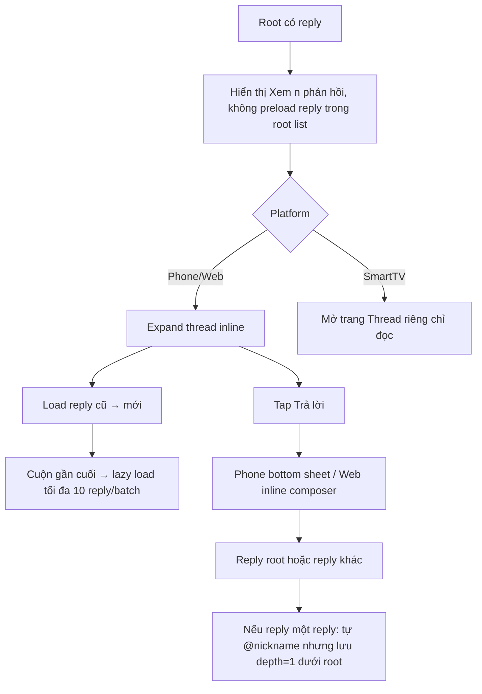

# User Flow — US08 Trả lời bình luận một cấp

> User Story: [US08_TRA_LOI_BINH_LUAN_MOT_CAP.md](US08_TRA_LOI_BINH_LUAN_MOT_CAP.md)

**Platforms:** Phone, Web; SmartTV chỉ đọc thread.

## UX đã chốt

- Root list không hiển thị sẵn reply; chỉ action `Xem {n} phản hồi`.
- Reply sort **cũ → mới**, lazy load tối đa 10/batch.
- Có reply mới khi thread mở: indicator `Có {n} phản hồi mới`; user bấm → tải và cuộn tới reply mới đầu tiên.
- SmartTV mở trang thread riêng, chỉ đọc; không Reply.
