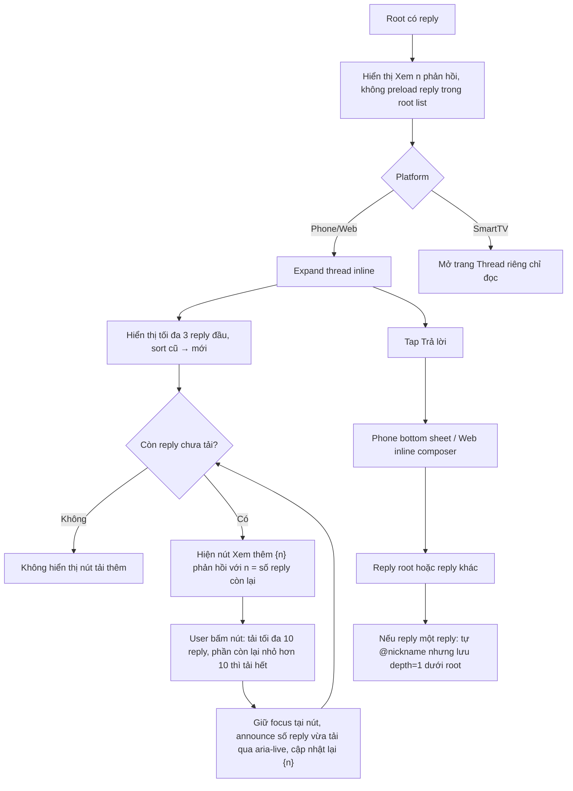

# User Flow — US08 Trả lời bình luận một cấp

> User Story: [US08_TRA_LOI_BINH_LUAN_MOT_CAP.md](US08_TRA_LOI_BINH_LUAN_MOT_CAP.md)

**Platforms:** Phone, Web; SmartTV chỉ đọc thread.

## UX đã chốt

- Root list không hiển thị sẵn reply; chỉ action `Xem {n} phản hồi`.
- Khi mở thread, **initial hiển thị tối đa 3 reply**, sort **cũ → mới** (AC9).
- Phần reply còn lại tải bằng **nút `[Xem thêm {n} phản hồi]`** — luôn kèm **số lượng reply còn lại**, không dùng chuỗi trần "Xem thêm phản hồi" và **không dùng infinite scroll/lazy load theo cuộn** cho reply. Mỗi lần bấm tải **tối đa 10 reply**; nếu phần còn lại <10 thì tải hết (AC10, TC-US08-008). Số `{n}` trên nút được cập nhật lại sau mỗi lần tải; hết reply thì ẩn nút.
- **A11y (REQUIREMENTS_A11Y_SECURITY.md mục A.2):** sau khi tải xong phải **giữ focus tại nút "Xem thêm {n} phản hồi"** (hoặc chuyển focus tới reply đầu tiên vừa tải theo thiết kế) và **announce số lượng vừa tải qua vùng `aria-live`** (ví dụ "Đã tải thêm 10 phản hồi"). Nút phải là `<button>` thật, touch target tối thiểu 44×44pt.
- Lưu ý phạm vi: **infinite scroll vẫn đúng cho danh sách root comment (US02)**; chỉ danh sách reply trong thread mới dùng nút "Xem thêm {n} phản hồi".
- Có reply mới khi thread mở: indicator `Có {n} phản hồi mới`; user bấm → tải và cuộn tới reply mới đầu tiên.
- SmartTV mở trang thread riêng, chỉ đọc; không Reply.
