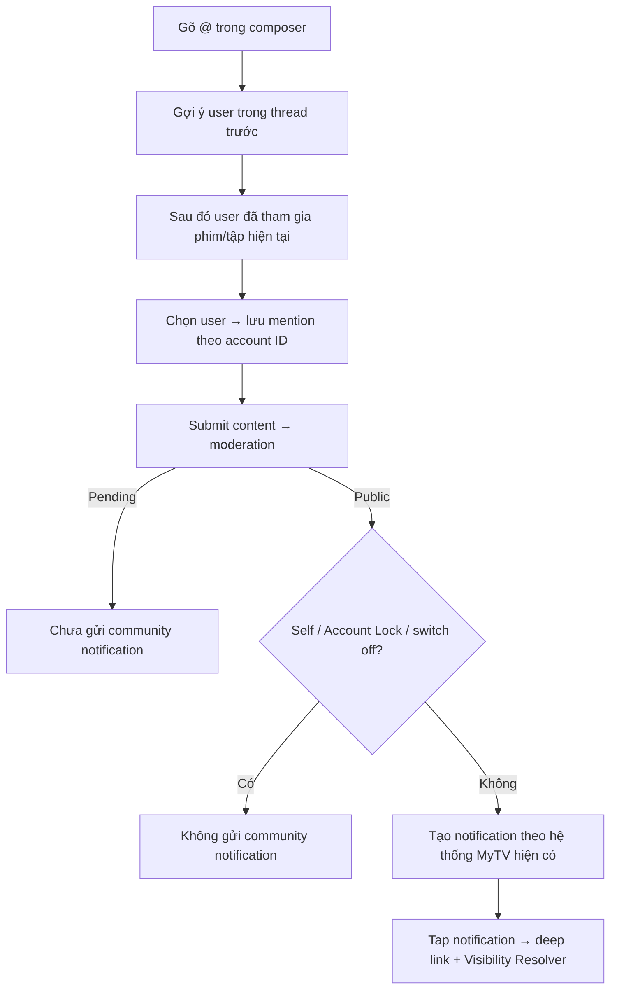

# User Flow — US09 Mention và thông báo

> User Story: [US09_MENTION_VA_NHAN_THONG_BAO.md](US09_MENTION_VA_NHAN_THONG_BAO.md)

**Platforms:** Phone, Web. SmartTV chỉ hiển thị mention trong nội dung.

## UX đã chốt

- Không tìm kiếm toàn bộ user MyTV; ưu tiên thread rồi content scope hiện tại.
- Notification Center **giữ nguyên 1 feed hiện có của MyTV**; flow này không thiết kế IA/tab/filter mới.
- Notification moderation/sanction/appeal/report-result vẫn bắt buộc theo business rule.
- SmartTV hiển thị `@nickname` để đọc nhưng không tạo Mention.
