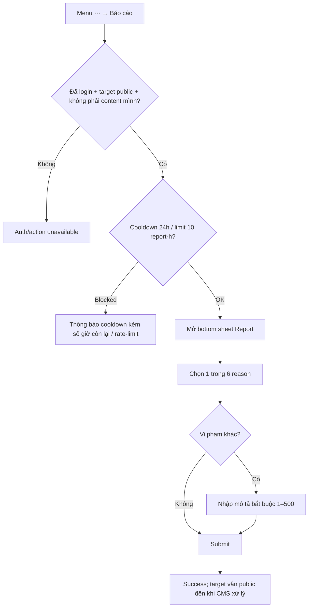

# User Flow — US10 Report bình luận

> User Story: [US10_REPORT_BINH_LUAN_VI_PHAM.md](US10_REPORT_BINH_LUAN_VI_PHAM.md)

**Platforms:** Phone, Web. SmartTV không Report.

## UX đã chốt

- Report mở bằng bottom sheet trên Phone/Web.
- Sau report thành công, action `Báo cáo` vẫn hiện; tap lại trong 24h báo đúng microcopy đã chốt tại US10: **“Bạn đã báo cáo bình luận này — Có thể báo cáo lại sau {n} giờ nếu nội dung vẫn còn.”** `{n}` là số giờ còn lại của cooldown 24h, phải hiển thị động để user biết cần chờ bao lâu.
- SmartTV không có Report; dùng Phone/Web.
