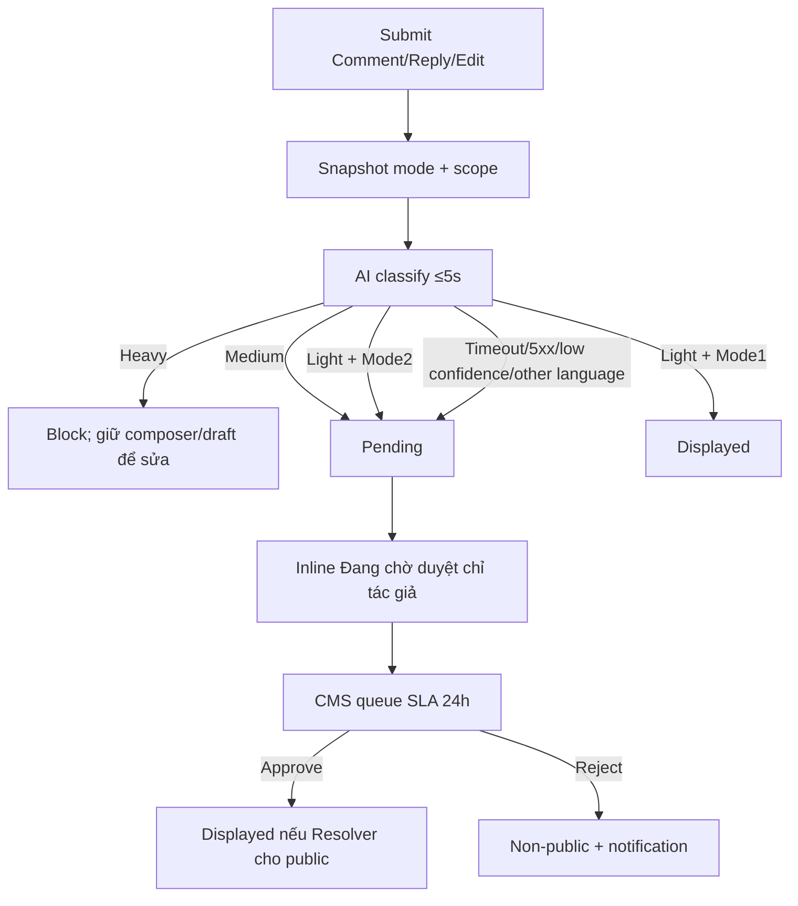

# User Flow — US11 AI kiểm duyệt theo hai chế độ

> User Story: [US11_AI_KIEM_DUYET_THEO_HAI_CHE_DO.md](US11_AI_KIEM_DUYET_THEO_HAI_CHE_DO.md)

## Nickname invariant đã chốt

Nickname dùng global policy riêng, không Mode1/2 và **không có Pending**. Safe/Light → save; Medium/Heavy → block. AI timeout/5xx/down → không đổi nickname, giữ old/fallback, retryable error, không queue và không tiêu quota đổi nickname.

## UX đã chốt

- Heavy content: giữ nguyên composer và draft, cho sửa/gửi lại.
- Pending item hiển thị inline chỉ tác giả.
- Pending item vẫn được edit; version pending cũ được thay bằng version mới, chạy moderation lại.
