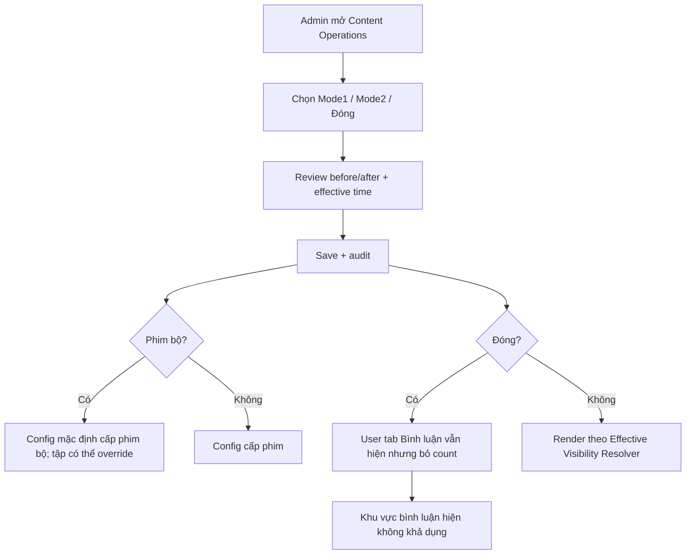

# User Flow — US12 Trạng thái và phạm vi hiển thị

> User Story: [US12_QUAN_LY_TRANG_THAI_VA_PHAM_VI_HIEN_THI_BINH_LUAN.md](US12_QUAN_LY_TRANG_THAI_VA_PHAM_VI_HIEN_THI_BINH_LUAN.md)

## UX/Scope đã chốt

- User-facing **không có scope Series**. Phim bộ chỉ đọc/comment/rating theo tập hiện tại.
- CMS vẫn có cấu hình mặc định cấp phim bộ để vận hành, từng tập override Mode1/Mode2/Đóng.
- Scope Đóng: tab `Bình luận` vẫn tồn tại, không count, không rating/list/composer/interaction.
- Deep link vào scope Đóng mở đúng phim/tập + tab Bình luận + fallback.
- Resolver priority: self-delete → own moderation → Admin root cascade → Account Lock → scope Closed.
