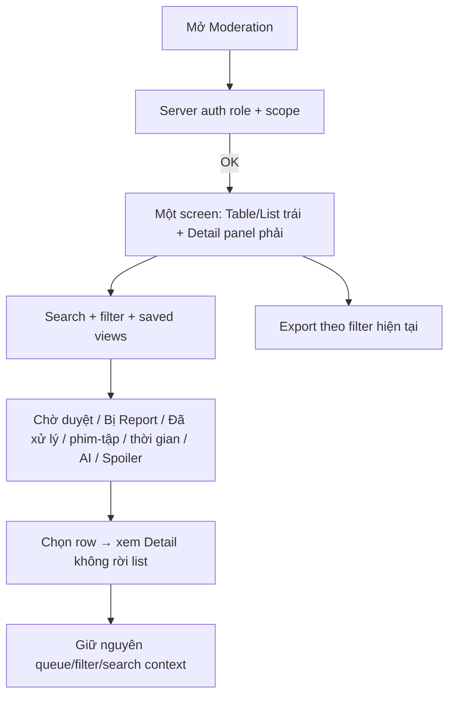

# User Flow — US13 Tra cứu bình luận trên CMS

> User Story: [US13_TRA_CUU_BINH_LUAN_TREN_CMS.md](US13_TRA_CUU_BINH_LUAN_TREN_CMS.md)

**Platform:** Web/Desktop only

## UX đã chốt

- Queue và Search **không tách navigation**; nằm trong một Moderation screen.
- Report là filter/saved view, không module riêng.
- Desktop only; không thiết kế CMS smartphone/tablet.
- Queue mặc định risk cao trước, cùng risk item chờ lâu hơn trước.
