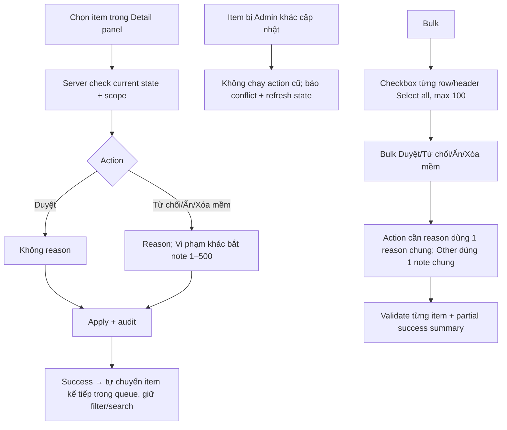

# User Flow — US14 Xử lý nội dung trên CMS

> User Story: [US14_XU_LY_NOI_DUNG_TREN_CMS.md](US14_XU_LY_NOI_DUNG_TREN_CMS.md)

**Platform:** Web/Desktop only

## UX đã chốt

- Report không tab riêng; Detail panel hiển thị report context.
- Bulk action bar chỉ hiện khi có selection.
- Sau single action thành công tự chuyển item kế tiếp; hết queue thì empty queue, không tự đổi filter.
- Optimistic concurrency: nếu stale, không overwrite im lặng.
