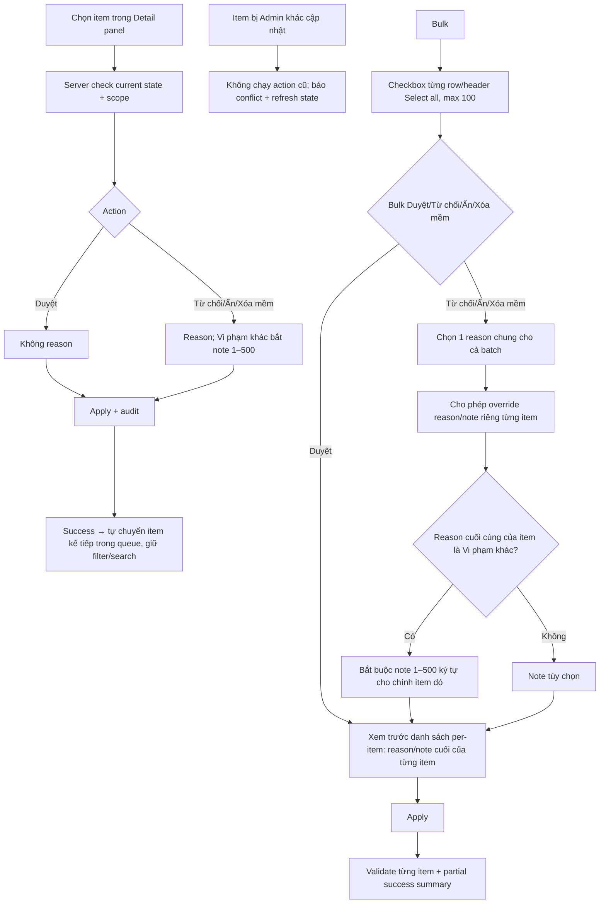

# User Flow — US14 Xử lý nội dung trên CMS

> User Story: [US14_XU_LY_NOI_DUNG_TREN_CMS.md](US14_XU_LY_NOI_DUNG_TREN_CMS.md)

**Platform:** Web/Desktop only

## UX đã chốt

- Report không tab riêng; Detail panel hiển thị report context.
- Bulk action bar chỉ hiện khi có selection.
- Sau single action thành công tự chuyển item kế tiếp; hết queue thì empty queue, không tự đổi filter.
- Optimistic concurrency: nếu stale, không overwrite im lặng.
- **Bulk reason (AC5–AC6 Bulk moderation, README mục 5.9):** Admin chọn **một reason chung cho batch** và **có thể override reason riêng cho từng item** trước khi Apply — không ép cả batch mang cùng một reason. Ví dụ chọn 40 comment gồm 38 Spam và 2 Spoiler: đặt reason chung "Spam/quảng cáo" rồi override 2 item sang "Spoiler", để thông báo gửi tác giả và audit log ghi đúng căn cứ chế tài của từng item.
- **Note theo reason cuối cùng của từng item**, không dùng 1 note chung: item nào có reason cuối là **"Vi phạm khác"** thì bắt buộc note **1–500 ký tự** hợp lệ (không chỉ khoảng trắng); item override sang reason khác không bị bắt note.
- Trước khi Apply, CMS hiển thị **bước xem trước danh sách per-item** (item — reason cuối — note) để Admin rà lại; sau Apply vẫn giữ **partial success summary** theo từng item.
