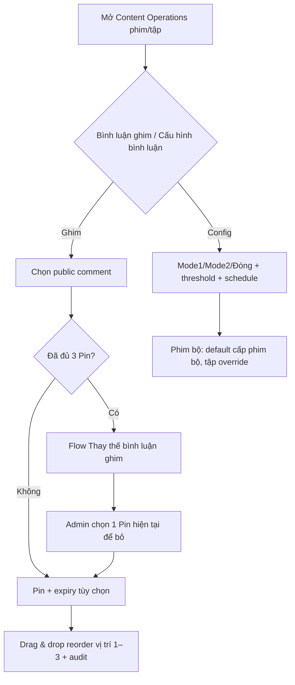

# User Flow — US15 Pin và cấu hình bình luận

> User Story: [US15_QUAN_LY_BINH_LUAN_NOI_BAT_VA_CAU_HINH_THEO_PHIM.md](US15_QUAN_LY_BINH_LUAN_NOI_BAT_VA_CAU_HINH_THEO_PHIM.md)

**Platform:** Web/Desktop only

## UX đã chốt

- Pin và Config nằm cùng trang **Content Operations**, 2 section.
- Pin max 3; pin thứ 4 phải chọn rõ Pin bị thay, không auto replace.
- Expiry optional, mặc định `Không hết hạn`.
- Reorder bằng drag & drop; save lỗi revert thứ tự server gần nhất.
- Phía user Pin luôn ở đầu mọi sort và có icon + chữ `Đã ghim`.
