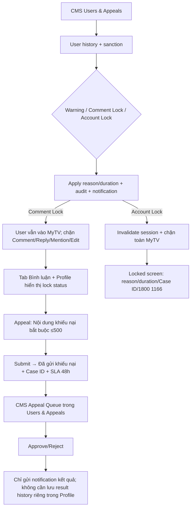

# User Flow — US16 Vi phạm, sanction và appeal

> User Story: [US16_QUAN_LY_NGUOI_DUNG_VI_PHAM_VA_AUDIT_LOG.md](US16_QUAN_LY_NGUOI_DUNG_VI_PHAM_VA_AUDIT_LOG.md)

**CMS:** Web/Desktop only

## UX đã chốt

- Comment Lock không banner toàn app; hiển thị trong tab Bình luận và Profile/Cài đặt.
- Appeal Comment Lock: 1 textarea bắt buộc tối đa 500; system tự attach case/sanction context.
- Sau submit hiển thị Case ID + `MyTV sẽ phản hồi trong vòng 48 giờ`.
- Kết quả appeal chỉ qua notification; không xây màn lịch sử appeal riêng.
- Account Lock áp dụng mọi platform, gồm SmartTV; appeal Account Lock qua Tổng đài MyTV 1800 1166.
