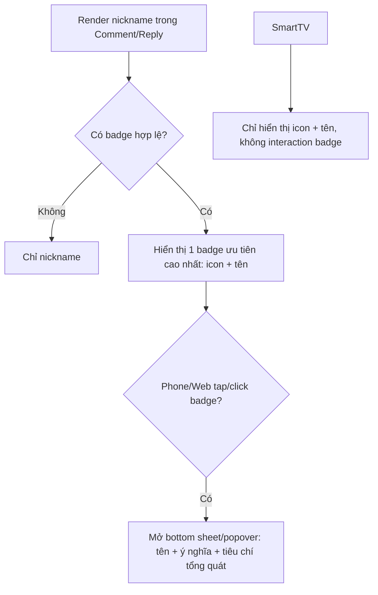

# User Flow — US17 Huy hiệu người dùng

> User Story: [US17_HUY_HIEU_NGUOI_DUNG.md](US17_HUY_HIEU_NGUOI_DUNG.md)

## UX đã chốt

- Ví dụ hiển thị: `Minh Anh · Fan kỳ cựu`.
- Không chỉ dùng icon/màu; phải có text alternative.
- Phone/Web mở giải thích badge tại chỗ, không rời thread.
- SmartTV chỉ hiển thị, không mở detail badge.
- Chỉ hiển thị 1 badge theo priority rule hiện hành.
