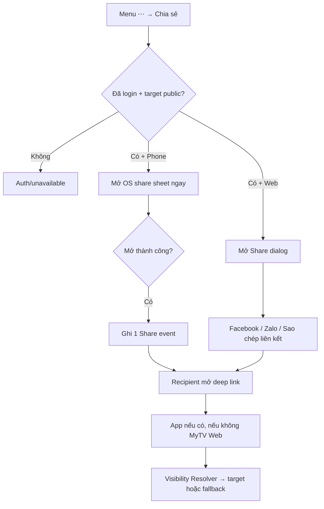

# User Flow — US18 Chia sẻ bình luận

> User Story: [US18_CHIA_SE_BINH_LUAN_VA_CANH_PHIM.md](US18_CHIA_SE_BINH_LUAN_VA_CANH_PHIM.md)

**Platforms:** Phone, Web. SmartTV không Share.

## UX đã chốt

- Share nằm trong menu `⋯`, không phải action ưu tiên cạnh Like/Reply.
- Phone không có preview/confirm trung gian; mở OS sheet ngay.
- Web dùng dialog riêng: **Facebook, Zalo, Sao chép liên kết**; không TikTok ở MVP Web.
- Payload/preview không chứa nguyên văn comment, nickname/phone/Spoiler; CTA `Xem nội dung này trên MyTV`.
- SmartTV không Share.
