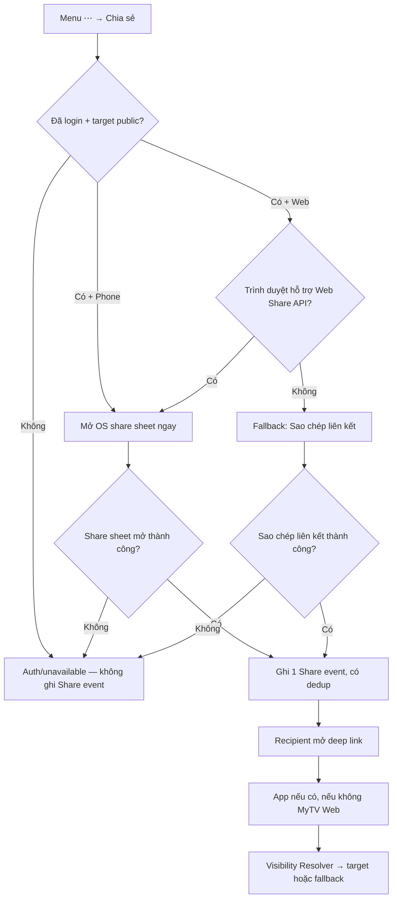

# User Flow — US18 Chia sẻ bình luận

> User Story: [US18_CHIA_SE_BINH_LUAN_VA_CANH_PHIM.md](US18_CHIA_SE_BINH_LUAN_VA_CANH_PHIM.md)

**Platforms:** Phone, Web. SmartTV không Share.

## UX đã chốt

- Share nằm trong menu `⋯`, không phải action ưu tiên cạnh Like/Reply.
- Phone không có preview/confirm trung gian; mở OS share sheet ngay.
- **MVP chỉ dùng OS share sheet, KHÔNG tích hợp SDK/kênh riêng cho bất kỳ mạng xã hội nào** (README mục 5.12, AC13). Web dùng **Web Share API / OS share sheet** khi trình duyệt hỗ trợ; trình duyệt không hỗ trợ thì fallback là **“Sao chép liên kết”**.
- **Mốc ghi nhận Share event — áp dụng cho CẢ Phone và Web** (AC14, AC15):
  - Phone và Web có Web Share API: ghi đúng **1 Share event khi share sheet mở thành công**; user cancel/đóng sau đó không hoàn tác event.
  - Web dùng fallback: ghi đúng **1 Share event khi sao chép liên kết thành công**.
  - Cả hai nhánh đều đi qua cùng một node ghi event và phải **dedup** để retry/lỗi kỹ thuật không làm tăng Share KPI sai.
  - Nhánh bị chặn (chưa login, target non-public, scope Đóng, Account Lock) hoặc mở sheet/copy thất bại thì **không ghi Share event**.
- Vì Share có trọng số ×2 trong Engagement Score (`Comment×2 + Reply×2 + Net Like + Rating + Share×2`), nhánh Web bắt buộc phải ghi event; nếu bỏ sót, dashboard và ranking phim sẽ thiếu điểm mà đối soát hằng ngày không phát hiện được do đối soát cùng nguồn sự kiện.
- Payload/preview không chứa nguyên văn comment, nickname/phone/Spoiler; CTA `Xem nội dung này trên MyTV`.
- SmartTV không Share.
