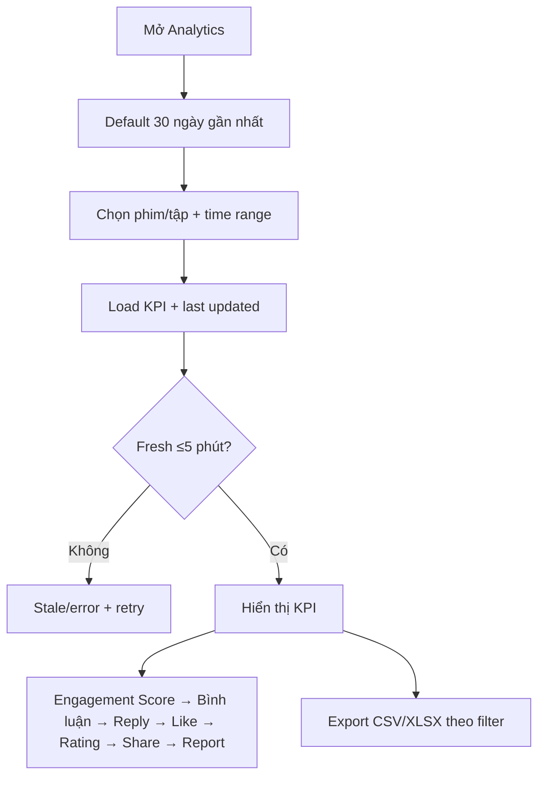

# User Flow — US19 Analytics bình luận

> User Story: [US19_THONG_KE_HOAT_DONG_BINH_LUAN.md](US19_THONG_KE_HOAT_DONG_BINH_LUAN.md)

**Platform:** CMS Web/Desktop only

## UX đã chốt

- Default time range: **30 ngày gần nhất**.
- KPI order: **Engagement Score → Bình luận → Reply → Like → Rating → Share → Report**.
- Giữ last-updated/stale state và export theo filter hiện tại.
- Scope Đóng không làm KPI lịch sử tự tụt; visibility/sanction/lifecycle áp dụng theo business rules hiện hành.
