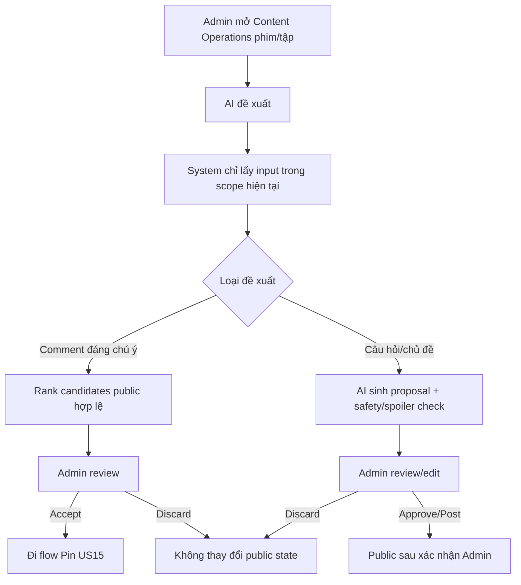

# User Flow — US20 AI hỗ trợ vận hành cộng đồng

> User Story: [US20_AI_HO_TRO_VAN_HANH_CONG_DONG.md](US20_AI_HO_TRO_VAN_HANH_CONG_DONG.md)

**Platform:** CMS Web/Desktop only

## UX đã chốt

- `AI đề xuất` nằm ngay trong **Content Operations của phim/tập hiện tại**, không có top-level AI Ops riêng.
- Không auto-run, auto-pin, auto-publish.
- Admin luôn review/confirm trước thay đổi public.
