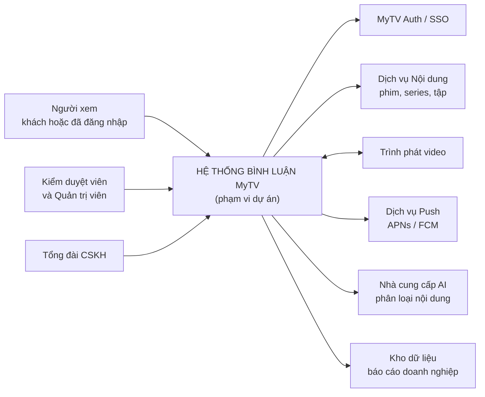
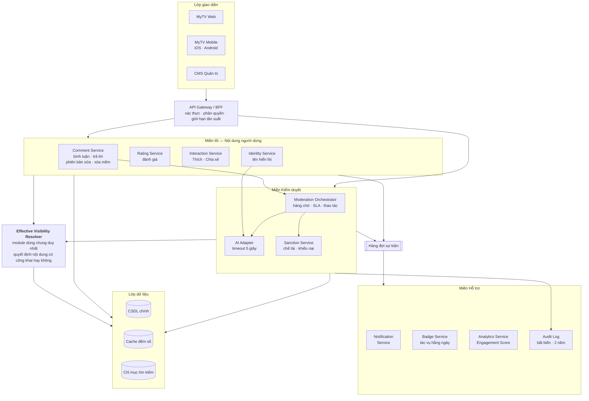
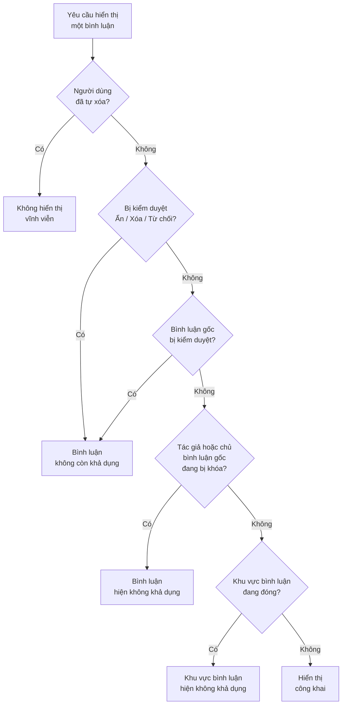
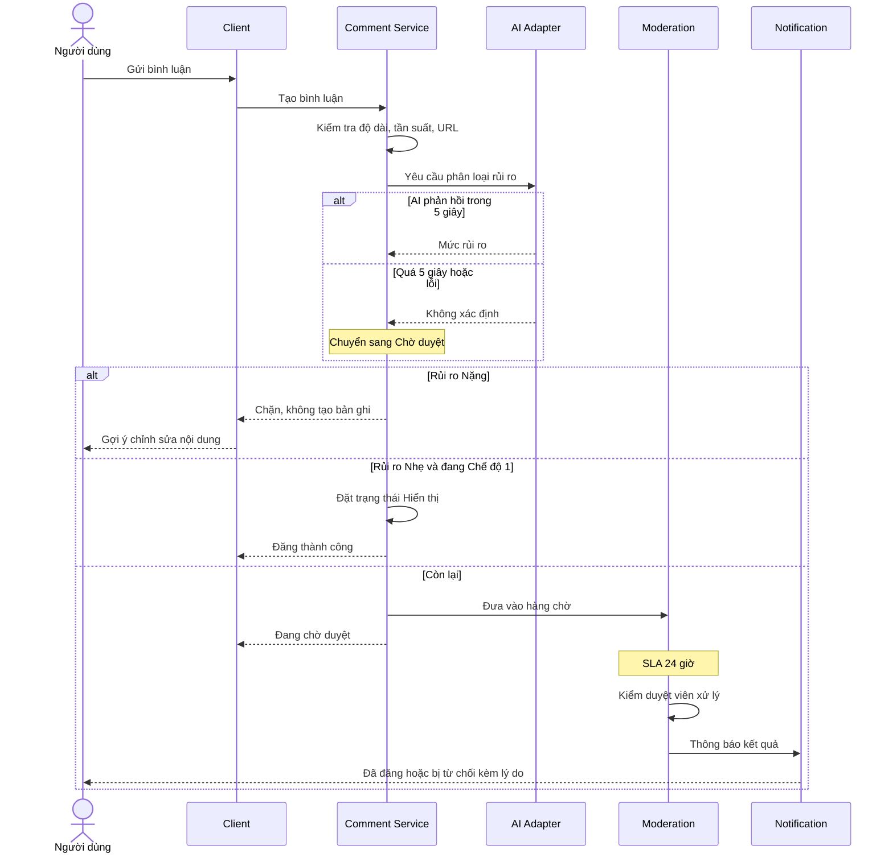

# Kiến trúc giải pháp — Tính năng Bình luận MyTV

**Phiên bản:** 1.1 · **Ngày:** 19/08/2026 · **Trạng thái:** Đã review theo backlog PO final · Chờ phê duyệt kiến trúc/kế hoạch triển khai
**Baseline backlog:** `main@29c63762630b6b3ab735a8781c43cf309311b3f0` — quyết định PO đã khóa đến Câu 169
**Phạm vi tài liệu:** Kiến trúc tổng thể ở mức giải pháp cho 5 Epic / 20 User Story trong backlog này
**Người đọc:** Product Owner, Ban lãnh đạo, Trưởng nhóm Kỹ thuật, Trưởng nhóm Vận hành

> Tài liệu này trả lời bốn câu hỏi: **Chúng ta xây cái gì? Xây thế nào? Xây theo thứ tự nào? Rủi ro ở đâu?**
> Tài liệu không đi vào chi tiết class/API — phần đó thuộc technical design sau khi bản này được duyệt.

---

## 1. Tóm tắt điều hành

MyTV bổ sung khu vực thảo luận cho phim truyện/VOD: người xem đọc bình luận không cần đăng nhập, đăng nhập để tương tác. Toàn bộ nội dung đi qua lớp kiểm duyệt kết hợp **AI + con người**, có CMS quản trị và hệ thống chỉ số riêng.

**Ba điều quan trọng nhất cần lãnh đạo nắm:**

| # | Vấn đề | Ý nghĩa với quyết định đầu tư |
|---|---|---|
| 1 | **Đây không phải tính năng "thêm ô comment"** — khối lượng đáng kể nằm ở kiểm duyệt, CMS, chế tài, audit, bảo mật và phân tích | Ngân sách và nhân sự phải tính cả phần vận hành, không chỉ phần hiển thị |
| 2 | **Chi phí vận hành liên tục là khoản chưa có trong backlog** — cần đội moderator trực để giữ SLA 24 giờ, và chi phí gọi AI theo lượng bình luận | Cần chốt ngân sách vận hành trước khi mở rộng ra toàn bộ thư viện phim |
| 3 | **Rủi ro lớn nhất là rò rỉ nội dung đã bị ẩn**, do có 5 cơ chế ẩn chồng nhau | Đã có phương án kiến trúc xử lý — tập trung logic vào một module duy nhất (mục 5) |

**Đề xuất kiến trúc/kế hoạch:** triển khai theo **4 giai đoạn**, ưu tiên ra mắt giới hạn ở nhóm phim thí điểm trước khi mở rộng. Con số **6–7 tháng / 1 squad** tại mục 7 chỉ là giả định lập kế hoạch sơ bộ, không phải cam kết delivery trước khi đội phát triển estimate.

**Trạng thái PO:** backlog không còn blocker PO đến Câu 169. Các mục tại phần 9 là quyết định đầu tư/vận hành/design cần chốt trước pilot hoặc trước khi cam kết rollout, không phải business rule còn mở.

---

## 2. Mục tiêu và phạm vi

### 2.1. Mục tiêu sản phẩm

1. Tạo không gian thảo luận quanh nội dung, tăng thời lượng và tần suất quay lại.
2. Chuyển đổi người xem thụ động thành người dùng có tài khoản (đọc tự do → đăng nhập để tương tác).
3. Giữ môi trường an toàn: kết hợp AI và kiểm duyệt viên, có chế tài và khiếu nại minh bạch.
4. Cung cấp dữ liệu vận hành để đội nội dung hiểu nội dung nào tạo thảo luận.

### 2.2. Trong phạm vi

- Phim truyện/VOD có timeline cố định; **phim lẻ bình luận và đánh giá ở cấp phim, phim bộ bình luận và đánh giá theo từng tập**. **Không có scope Series phía người xem.** Cấu hình cấp series vẫn tồn tại ở CMS (AI threshold/mode kế thừa episode override → series override → default hệ thống, US15) — đó là cấu hình quản trị, không phải scope bình luận của người xem.
- Đọc công khai; đăng nhập mới được Bình luận, Trả lời, Thích, Nhắc tên, Báo cáo, Đánh giá, Chia sẻ.
- Trả lời **một cấp** (không lồng sâu).
- Kiểm duyệt AI hai chế độ + kiểm duyệt viên, có trạng thái và nhật ký kiểm toán rõ ràng.
- CMS: tra cứu, xử lý nội dung, ghim, cấu hình theo phim, chế tài người dùng, audit.
- Tăng trưởng: huy hiệu, chia sẻ deep link, thống kê, AI hỗ trợ vận hành.

### 2.3. Ngoài phạm vi giai đoạn này

| Hạng mục | Lý do |
|---|---|
| Nội dung phát trực tiếp (live) | Timestamp và moderation thời gian thực là bài toán khác |
| Thể thao / thiếu nhi / giải trí | Cần chính sách kiểm duyệt riêng theo nhóm khán giả |
| Frame/clip đính kèm bình luận | Đã chốt loại khỏi MVP; chỉ dùng mốc thời gian |
| Trả lời lồng nhiều cấp | Quyết định sản phẩm đã khóa: một cấp |
| Tin nhắn riêng giữa người dùng | Không thuộc mục tiêu thảo luận quanh nội dung |

### 2.4. Ràng buộc đã khóa

- Xác thực dùng hệ thống đăng nhập MyTV sẵn có, **không xây riêng**.
- Lưu nội dung xóa mềm **90 ngày**; nhật ký kiểm toán **2 năm** (hai đồng hồ độc lập).
- AI moderation timeout **5 giây**, hỗ trợ tiếng Việt và tiếng Anh; ngoài ra chuyển kiểm duyệt viên.
- SLA kiểm duyệt **24 giờ**, SLA khiếu nại **48 giờ** — quá hạn không tự động duyệt.
- Khiếu nại khóa tài khoản đi qua tổng đài, vì người dùng không vào được ứng dụng.
- Account Lock screen dùng **Tổng đài MyTV 1800 1166 (miễn phí, hỗ trợ 24/7)**; Support/CSKH chuyển appeal vào CMS.
- Nickname đổi tối đa **1 lần thành công/24 giờ/account**; submission bị validation/AI chặn không tiêu quota.
- Edit Comment/Reply tối đa **5 lần/phút/target**, chặn trước khi tạo version/gọi AI khi vượt ngưỡng.
- Badge 90 ngày dùng tên hiển thị **Fan kỳ cựu**.
- Accessibility **WCAG 2.1 AA** và yêu cầu bảo mật XSS/IDOR/PII là yêu cầu xuyên suốt theo `REQUIREMENTS_A11Y_SECURITY.md`.
- **Nickname khi AI không có quyết định hợp lệ — đã chốt, không còn là điểm tồn đọng refinement:** nickname **không bao giờ** có trạng thái Chờ duyệt. AI timeout quá 5 giây, lỗi 5xx, dịch vụ AI không khả dụng, nickname ngoài tiếng Việt/tiếng Anh và nickname low-confidence đều được xử lý **giống nhau**: **không đổi nickname**, giữ nickname hợp lệ cũ (hoặc mask số điện thoại nếu chưa từng có nickname hợp lệ), báo lỗi **cho phép thử lại**, **không tạo hàng chờ duyệt / queue item** và **không tiêu quota** 1 lần đổi/24 giờ. Kiến trúc không tạo nickname-pending state; US11 đã được đồng bộ theo đúng invariant này.

---

## 3. Bối cảnh hệ thống

Tính năng Bình luận là một miền nghiệp vụ mới, tiêu thụ dịch vụ sẵn có của MyTV chứ không thay thế chúng.

**Điểm cần lưu ý về ranh giới:**

- **Trình phát video là quan hệ hai chiều** — bình luận đọc mốc thời gian hiện tại từ trình phát, và ra lệnh cho trình phát nhảy tới mốc. Đây là tích hợp chặt nhất, cần thống nhất hợp đồng giao tiếp sớm.
- **Nhà cung cấp AI là phụ thuộc bên ngoài có chi phí theo lượt gọi** — các submission cần moderation sau khi vượt qua validation/rate-limit sẽ phát sinh AI decision. Xem rủi ro R-04.
- **Tổng đài CSKH là một "người dùng" thật của hệ thống**, không phải kênh phụ: họ tiếp nhận khiếu nại khóa tài khoản và nhập vào CMS. Cần đào tạo và quy trình, không chỉ cần phần mềm.

---

## 4. Kiến trúc tổng thể

### 4.0. Cách hiểu sơ đồ

Các khối mang tên `... Service` trong tài liệu này là **logical component / bounded responsibility**, chưa phải quyết định mỗi khối phải là một microservice triển khai độc lập. Technical design Giai đoạn 0 sẽ chốt deployment topology dựa trên tải, ownership, khả năng vận hành và nền tảng hiện có của MyTV. Có thể bắt đầu bằng **modular monolith + worker/event components** nếu phù hợp, miễn vẫn giữ ranh giới trách nhiệm và contract rõ ràng.

`Effective Visibility Resolver` là **logic dùng chung bắt buộc**, nhưng không nhất thiết phải là một network hop riêng. Ưu tiên thiết kế để mọi read path dùng cùng implementation/policy version, tránh copy logic giữa BFF/service/client.

### 4.1. Trách nhiệm từng khối

| Khối | Trách nhiệm chính | User Story liên quan |
|---|---|---|
| **Comment Service** | Vòng đời bình luận/trả lời, lịch sử phiên bản khi sửa, xóa mềm 90 ngày, cascade khi xóa gốc | US01, US02, US04, US05, US08 |
| **Rating Service** | Một đánh giá hiện hành mỗi tài khoản mỗi phạm vi, tính điểm trung bình; nhận `content_completed` từ Player khi đạt 90% duration hoặc end-of-content event để mở post-watch rating prompt; Comment Area chỉ hiển thị aggregate khi `total > 0` | US03 |
| **Interaction Service** | Thích/Bỏ thích gom theo lô 5 giây, gộp về trạng thái cuối, sự kiện Chia sẻ có khử trùng lặp | US07, US18 |
| **Identity Service** | Tên hiển thị duy nhất không phân biệt hoa thường, chính sách kiểm duyệt riêng, mặt nạ số điện thoại | US04 |
| **Effective Visibility Resolver** | **Nguồn chân lý duy nhất** trả lời "nội dung này có được hiển thị công khai không, và nếu không thì vì sao" | US12 (định nghĩa gốc), dùng bởi tất cả |
| **Moderation Orchestrator** | Hàng chờ ưu tiên theo mức rủi ro, SLA 24 giờ, thao tác đơn và hàng loạt, hoàn tác | US11, US12, US13, US14 |
| **AI Adapter** | Gọi nhà cung cấp AI, xử lý timeout/lỗi; Comment/Reply/Edit fail-safe về queue. Nickname giữ invariant **không có Pending** và không được đổi/public khi chưa có AI decision hợp lệ | US11 |
| **Sanction Service** | Cảnh báo, khóa bình luận, khóa tài khoản, khiếu nại và SLA 48 giờ | US16 |
| **Notification Service** | Tách bạch **thông báo bắt buộc** (kiểm duyệt, chế tài, khiếu nại) và **thông báo cộng đồng** có công tắc tắt | US09 |
| **Badge Service** | Tác vụ hằng ngày, cửa sổ trượt 30/90 ngày, ân hạn 7 ngày | US17 |
| **Analytics Service** | Engagement Score, độ tươi tối đa 5 phút, snapshot Net Like/Rating theo thời điểm cuối kỳ khi filter lịch sử, báo thiếu dữ liệu nếu không có snapshot, đối soát hằng ngày | US19 |
| **Audit Log** | Ghi bất biến mọi thao tác quản trị, lưu 2 năm độc lập với vòng đời nội dung | US14, US16 |

---

## 5. Quyết định kiến trúc trọng yếu

Bảy quyết định dưới đây định hình toàn bộ giải pháp. Mỗi quyết định nêu rõ đánh đổi để lãnh đạo cân nhắc.

### AD-01 — Gom toàn bộ logic hiển thị vào một module dùng chung

**Bối cảnh.** Một bình luận có thể bị ẩn bởi **năm cơ chế độc lập**: người dùng tự xóa, kiểm duyệt viên ẩn/xóa/từ chối, ẩn lây theo bình luận gốc, khóa tài khoản tác giả, và đóng khu vực bình luận theo phim. Các cơ chế này chồng lên nhau; dữ liệu phải lưu các gate active độc lập, không chỉ gate thắng priority.

**Quyết định.** Không cho phép bất kỳ dịch vụ nào tự tính khả năng hiển thị. Mọi truy vấn đi qua **Effective Visibility Resolver** với thứ tự ưu tiên đã chốt: *tự xóa → kiểm duyệt riêng → ẩn lây theo gốc → khóa tài khoản → đóng khu vực*. Gate active được lưu bằng tập/cờ độc lập; `cascade_source` chỉ dùng cho delete cascade (`self_delete`/`admin_root_delete`), không dùng cho visibility cascade tạm thời.

**Đánh đổi.** Thêm một điểm phụ thuộc chung và một chặng gọi nội bộ. Đổi lại, loại bỏ được lớp lỗi nguy hiểm nhất của tính năng này — mỗi nơi tính một kiểu dẫn tới lộ nội dung đã bị ẩn.

**Vì sao quan trọng với lãnh đạo:** rò rỉ một bình luận đã bị gỡ là sự cố truyền thông, không phải lỗi kỹ thuật thông thường.

### AD-02 — Tách bạch "trạng thái kiểm duyệt" và "khả năng hiển thị thực tế"

**Quyết định.** Một bình luận giữ **trạng thái kiểm duyệt** riêng (Chờ duyệt / Hiển thị / Từ chối / Ẩn / Xóa mềm) và một **khả năng hiển thị thực tế** được tính động. Khóa tài khoản hay đóng khu vực bình luận **không làm thay đổi** trạng thái kiểm duyệt.

**Đánh đổi.** Phức tạp hơn mô hình một cờ đơn giản. Đổi lại, khi mở khóa tài khoản hoặc mở lại khu vực bình luận, nội dung tự khôi phục đúng trạng thái cũ mà không cần công việc thủ công — tiết kiệm rất nhiều chi phí vận hành.

### AD-03 — Ưu tiên nhất quán hơn tức thời cho các con số

**Quyết định.** Nút Thích cập nhật giao diện ngay (lạc quan), gom theo lô tối đa 5 giây rồi đồng bộ; **máy chủ luôn là nguồn chân lý** và giao diện phải chấp nhận quay lại theo máy chủ. Các chỉ số tổng hợp có độ trễ tối đa 5 phút, kèm đối soát hằng ngày tự sửa sai lệch.

**Đánh đổi.** Người dùng có thể thấy số Thích nhảy lùi trong tình huống hiếm. Đổi lại, giảm mạnh tải ghi và tránh việc bảng xếp hạng bị thao túng bởi lỗi đồng bộ.

### AD-04 — Chế độ 1 là mặc định; Chế độ 2 là override vận hành theo scope

**Bối cảnh.** Chế độ 2 đưa toàn bộ Comment/Reply/Edit không bị AI chặn vào hàng chờ Admin trước khi public, nên làm tăng tải moderation.

**Quyết định.** Theo backlog final, **Chế độ 1 là mặc định cho content scope**. Series có thể cấu hình Mode1/Mode2/Đóng; episode có thể override series. Việc chuyển mode có `effective time` và audit theo US11/US15. Tài liệu kiến trúc **không tự thêm yêu cầu Mode2 luôn phải có expiry**; nếu vận hành muốn dùng Mode2 theo thời gian, thực hiện bằng scheduled config/effective transition đã có.

**Đánh đổi.** Chế độ 1 ưu tiên tốc độ hiển thị nhưng chấp nhận risk của hậu kiểm; Chế độ 2 ưu tiên tiền kiểm nhưng tăng queue. Khẩu vị sử dụng Mode2 là **guardrail vận hành** cần theo dõi bằng capacity/SLA, không còn là blocker PO.

### AD-05 — Nhật ký kiểm toán sống lâu hơn raw content nhưng không kéo dài retention raw content

**Quyết định.** Nội dung soft-delete giữ **90 ngày** theo lifecycle; audit event giữ **2 năm** theo US16. Audit tối thiểu giữ actor, time, target, action, before/after state, reason và policy/version cần thiết để giải trình. **Không mặc định lưu nguyên văn raw comment/PII trong audit suốt 2 năm**, vì điều đó sẽ vô tình biến retention nội dung 90 ngày thành 2 năm.

Nếu pháp chế/compliance sau này yêu cầu evidence snapshot dài hơn 90 ngày, phải có **retention policy riêng được phê duyệt**, quy định rõ trường dữ liệu, masking/encryption/access control và cơ chế purge; không được suy ra từ tài liệu kiến trúc này.

**Đánh đổi.** Audit sau ngày 90 có thể không còn raw text để xem lại, nhưng vẫn giữ đủ metadata trạng thái/quyết định theo backlog mà không phá vỡ retention content.

### AD-06 — Sự kiện bất đồng bộ phải có outbox và consumer idempotent

**Bối cảnh.** Notification, badge và analytics phụ thuộc event từ Comment/Interaction/Moderation. Nếu ghi DB thành công nhưng publish event thất bại, hệ thống có thể mất notification/KPI; nếu retry không idempotent có thể cộng KPI hoặc gửi thông báo trùng.

**Quyết định.** Với event nghiệp vụ cần phát sau transaction, dùng **transactional outbox (hoặc cơ chế tương đương bảo đảm atomicity)**; consumer phải idempotent theo `event_id`/business key. Audit bắt buộc của hành động quản trị không được phụ thuộc duy nhất vào eventual event path.

**Đánh đổi.** Tăng độ phức tạp vận hành queue/outbox, đổi lại đáp ứng các rule retry/dedup đã có trong US07/US09/US18/US19 và giảm mất sự kiện.

### AD-07 — AI moderation không phải security boundary

**Quyết định.** AI chỉ phân loại **ngữ nghĩa/chính sách cộng đồng**. Authentication/authorization, IDOR scope check, validation, sanitization/escaping XSS, PII masking và session invalidation phải được enforce độc lập theo `REQUIREMENTS_A11Y_SECURITY.md`. Một kết quả AI “Nhẹ/An toàn” không cho phép bỏ qua sanitization.

**Đánh đổi.** Có nhiều lớp kiểm soát hơn, nhưng tránh phụ thuộc model để thực hiện chức năng bảo mật mà model không bảo đảm.

---

## 6. Các luồng nghiệp vụ chính

### 6.1. Đăng bình luận qua kiểm duyệt

**Điểm đáng chú ý:** nhánh timeout không phải trường hợp hiếm cần bỏ qua. Mọi lỗi AI đều **đổ tải sang con người**. Tỷ lệ timeout tăng 5% có thể làm khối lượng hàng chờ tăng gấp nhiều lần — cần giám sát chỉ số này như một chỉ số vận hành, không phải chỉ số kỹ thuật.

### 6.2. Vòng đời một bình luận

```mermaid
stateDiagram-v2
    [*] --> ChoDuyet: "AI trung bình hoặc Chế độ 2"
    [*] --> HienThi: "AI nhẹ và Chế độ 1"
    [*] --> [*]: "AI nặng — chặn ngay"

    ChoDuyet --> HienThi: "Admin duyệt"
    ChoDuyet --> TuChoi: "Admin từ chối"

    HienThi --> An: "Admin ẩn"
    HienThi --> XoaMemAdmin: "Admin xóa mềm"
    HienThi --> XoaMemSelf: "User tự xóa"

    TuChoi --> ChoDuyet: "Undo Reject"
    An --> HienThi: "Undo Hide"
    XoaMemAdmin --> HienThi: "Undo Admin delete nếu state trước xóa là Hiển thị"
    XoaMemAdmin --> [*]: "Hết retention 90 ngày"
    XoaMemSelf --> [*]: "Không được Undo public; hết retention 90 ngày"

    note right of HienThi
        Hiển thị chỉ là điều kiện cần.
        Account Lock hoặc scope Đóng
        có thể làm content non-public
        mà không đổi moderation state.
    end note

    note left of ChoDuyet
        Edit tạo một version Chờ duyệt riêng;
        version public cũ vẫn tiếp tục hiển thị
        cho tới khi edit được duyệt.
    end note
```

> Sơ đồ trên là **simplified state view** cho các transition phổ biến. Với CMS/Admin Soft-delete, Undo phải trả item về **state ngay trước Delete** theo US14; nếu state trước Delete không phải Hiển thị thì implementation phải restore đúng state đó, không ép về Hiển thị.

---

## 7. Lộ trình triển khai

### 7.1. Nguyên tắc phân chia

Backlog có **15/20 User Story ở mức Must** — nếu hiểu "Must" là "phải có trong bản đầu tiên" thì không thể ra mắt trong thời gian hợp lý. Vì vậy các giai đoạn dưới đây chia theo **phụ thuộc kỹ thuật và khả năng ra mắt an toàn**, không chia theo nhãn ưu tiên.

Nguyên tắc chốt: **không ra mắt bất kỳ tính năng viết nào khi chưa có công cụ kiểm duyệt tương ứng.** Điều này giải thích vì sao CMS (US13, US14) nằm ngay ở Giai đoạn 1 dù thường bị coi là việc nội bộ.

### 7.2. Exit criteria đề xuất trước khi mở rộng khỏi pilot

Các ngưỡng số cụ thể cần baseline từ pilot, nhưng tối thiểu phải chứng minh:

1. **Visibility safety:** test matrix Effective Visibility Resolver pass ở API + Web + Mobile; không có đường đọc bypass resolver/authorization.
2. **Moderation capacity:** queue age và tỷ lệ quá SLA 24h ở mức đội vận hành có thể duy trì; AI timeout/fallback không làm queue mất kiểm soát.
3. **Appeal E2E:** luồng Account Lock → 1800 1166/CSKH → CMS → quyết định appeal chạy được và đo SLA 48h.
4. **Data correctness:** Like/Share/Rating/Comment event dedup, outbox/consumer retry và daily reconciliation chạy được; không có sai lệch KPI kéo dài.
5. **Security:** không còn lỗ hổng mức nghiêm trọng cao ở XSS/IDOR/session invalidation/PII trên critical path.
6. **Accessibility:** critical flows đạt checklist WCAG 2.1 AA trong `REQUIREMENTS_A11Y_SECURITY.md`.
7. **Observability:** có dashboard/alert cho AI timeout, moderation queue age, event/outbox lag, notification failure, reconciliation delta và resolver non-public reason.

---

## 8. Rủi ro và phương án giảm thiểu

| Mã | Rủi ro | Mức | Phương án giảm thiểu |
|---|---|---|---|
| **R-01** | **Năng lực kiểm duyệt không đủ giữ SLA 24 giờ.** Backlog mô tả SLA nhưng không nói ai trực và bao nhiêu người | Cao | Đo khối lượng thực tế ở giai đoạn thí điểm trước khi mở rộng; mặc định Chế độ 1 (AD-04); xây bảng theo dõi hàng chờ theo thời gian thực từ Giai đoạn 1 |
| **R-02** | **Rò rỉ nội dung đã bị ẩn** do năm cơ chế ẩn chồng nhau tính không thống nhất | Cao | Module hiển thị dùng chung (AD-01); bộ kiểm thử ma trận trạng thái bắt buộc; kiểm tra ở cả giao diện và API |
| **R-03** | **Yêu cầu bảo mật/A11y đã có nhưng có nguy cơ được implement không đồng đều giữa Web/Mobile/CMS/service.** | Cao | Dùng `REQUIREMENTS_A11Y_SECURITY.md` làm Definition of Done xuyên suốt; test XSS/IDOR/PII/WCAG trên các critical flow; không coi AI moderation là security control |
| **R-04** | **Chi phí AI tăng theo lượng nội dung/version cần phân loại** | Trung bình | Áp quota đã khóa: nickname 1 lần đổi thành công/24h/account, Edit 5 lần/phút/target; theo dõi cost/1.000 AI decisions ở pilot; cache không được làm sai policy version hoặc bỏ moderation bắt buộc |
| **R-05** | **Phụ thuộc một nhà cung cấp AI duy nhất**, chỉ hỗ trợ tiếng Việt và tiếng Anh | Trung bình | Thiết kế lớp adapter để thay nhà cung cấp; dự phòng luôn là chuyển kiểm duyệt viên, không bao giờ tự động hiển thị |
| **R-06** | **Tích hợp trình phát video hai chiều** chưa có hợp đồng giao tiếp; ảnh hưởng cả tính năng mốc thời gian | Trung bình | Chốt hợp đồng giao tiếp với đội trình phát ngay Giai đoạn 0, dù tính năng thuộc Giai đoạn 3 |
| **R-07** | **Quy trình appeal Account Lock phụ thuộc phối hợp CSKH → CMS.** Người bị khóa không vào được ứng dụng | Trung bình | Dùng Tổng đài MyTV **1800 1166 (miễn phí, 24/7)** theo backlog; chốt SOP/ownership với CSKH trước Giai đoạn 2, theo dõi SLA 48 giờ và mã vụ việc end-to-end |
| **R-08** | **Sai lệch số liệu giữa giao diện và máy chủ** do cập nhật lạc quan và gom theo lô | Thấp | Máy chủ là nguồn chân lý (AD-03); đối soát hằng ngày; theo dõi tỷ lệ lệch |

---

## 9. Các quyết định triển khai/đầu tư còn cần chốt

**Không còn blocker PO trong backlog đến Câu 169.** Các mục dưới đây là quyết định quản trị delivery/kiến trúc/vận hành, không thay đổi business rule đã khóa.

| # | Điểm cần chốt | Ai quyết | Mốc cần chốt |
|---|---|---|---|
| 1 | **Ngân sách vận hành thường xuyên**: moderator capacity, AI cost envelope, on-call/CSKH ownership | Ban lãnh đạo + Vận hành | Trước khi mở pilot có user thật; phải đủ để giữ SLA 24h/48h |
| 2 | **Pilot scope và tiêu chí mở rộng**: nhóm phim/tập nào tham gia, thời gian pilot, ngưỡng go/no-go | PO + Vận hành + Kỹ thuật | Trước cuối Giai đoạn 1 |
| 3 | **Hợp đồng tích hợp Player**: đọc current timestamp, seek, lỗi/fallback, versioning contract | Trưởng nhóm Player + Solution/Tech Lead | Trong Giai đoạn 0, trước khi triển khai US06 |
| 4 | **Deployment topology**: modular monolith hay tách service/worker, hạ tầng queue/search/cache và ownership | Solution Architect + Tech Lead/Platform | Cuối Giai đoạn 0 sau sizing/estimate |
| 5 | **Bố cục UI**: vị trí comment area, cách rút gọn nội dung dài, cách hiển thị context phim/tập đang xem | PO + Design | Trước khi finalize wireframe Giai đoạn 1 |

### 9.1. Guardrail Mode1/Mode2 đã có

- **Mode1 là default** theo US11; không cần lãnh đạo quyết lại business rule này.
- Mode2 là override theo series/episode cho tình huống cần tiền kiểm chặt hơn.
- Vận hành nên theo dõi queue age/SLA và tránh mở Mode2 diện rộng nếu chưa chứng minh capacity.
- Mọi thay đổi mode phải có effective time + audit theo backlog.

### 9.2. Bốn mục PO của gói rà soát trước đã đóng

- Nickname: **1 lần đổi thành công/24 giờ/account**.
- Edit Comment/Reply: **5 lần/phút/target**.
- Account Lock appeal: **Tổng đài MyTV 1800 1166 — miễn phí, 24/7**.
- Badge 90 ngày: tên hiển thị **Fan kỳ cựu**.

---

## 10. Chỉ số đo lường thành công

Các chỉ số được nhóm theo mục tiêu, lấy từ phần chỉ số của từng Epic trong backlog.

| Nhóm | Chỉ số | Ý nghĩa |
|---|---|---|
| **Tiếp cận** | Tỷ lệ người xem mở khu vực bình luận | Tính năng có được nhìn thấy không |
| **Chuyển đổi** | Tỷ lệ đăng nhập sau khi chọn thao tác tương tác | Bình luận có kéo được người dùng tạo tài khoản không |
| **Tham gia** | Tỷ lệ người xem gửi bình luận hoặc đánh giá | Có bao nhiêu người chuyển từ đọc sang viết |
| **Chất lượng thảo luận** | Tỷ lệ bình luận nhận ít nhất một Thích hoặc Trả lời | Nội dung có tạo ra hội thoại thật không |
| **An toàn** | Tỷ lệ nội dung an toàn được tự động hiển thị | Hiệu quả của AI — càng cao càng đỡ tải cho người |
| **An toàn** | Tỷ lệ lọt vi phạm sau khi đã hiển thị | Chỉ số rủi ro quan trọng nhất |
| **Vận hành** | Thời gian xử lý hàng chờ và tỷ lệ quá SLA | Sức khỏe của đội kiểm duyệt |
| **Vận hành** | Tỷ lệ lỗi hoặc timeout của AI | Cảnh báo sớm cho việc quá tải hàng chờ |
| **Tăng trưởng** | Tỷ lệ chuyển đổi từ liên kết chia sẻ sang xem phim | Giá trị lan truyền |

**Đề xuất ngưỡng đánh giá cho giai đoạn thí điểm:** thay vì đặt mục tiêu tuyệt đối khi chưa có dữ liệu nền, dùng giai đoạn thí điểm để **thiết lập đường cơ sở**, rồi mới đặt mục tiêu cho giai đoạn ra mắt rộng.

---

## 11. Tài liệu liên quan

| Tài liệu | Nội dung |
|---|---|
| [README.md](README.md) | Backlog gốc: 5 Epic, 20 User Story, các quyết định nghiệp vụ đã khóa |
| [REQUIREMENTS_A11Y_SECURITY.md](REQUIREMENTS_A11Y_SECURITY.md) | Yêu cầu khả năng tiếp cận WCAG 2.1 AA và bảo mật dùng chung |
| `README.md` @ `29c63762630b6b3ab735a8781c43cf309311b3f0` | Baseline backlog PO final dùng để review kiến trúc phiên bản 1.1 |
| `EP01` … `EP05` | Chi tiết từng User Story kèm tiêu chí chấp nhận và ca kiểm thử |

**Các bước tiếp theo:**

1. Technical design chi tiết: mô hình dữ liệu, hợp đồng API, deployment topology, transactional outbox/idempotency và thiết kế module Effective Visibility Resolver dùng chung.
2. Buổi ước lượng cùng đội phát triển để thay các con số sơ bộ ở mục 7 bằng cam kết thật.
3. Wireframe và luồng màn hình cho Giai đoạn 1, sau khi ba quyết định bố cục ở mục 9 được chốt.
4. Kế hoạch vận hành: tuyển dụng và đào tạo kiểm duyệt viên, quy trình phối hợp với CSKH.
