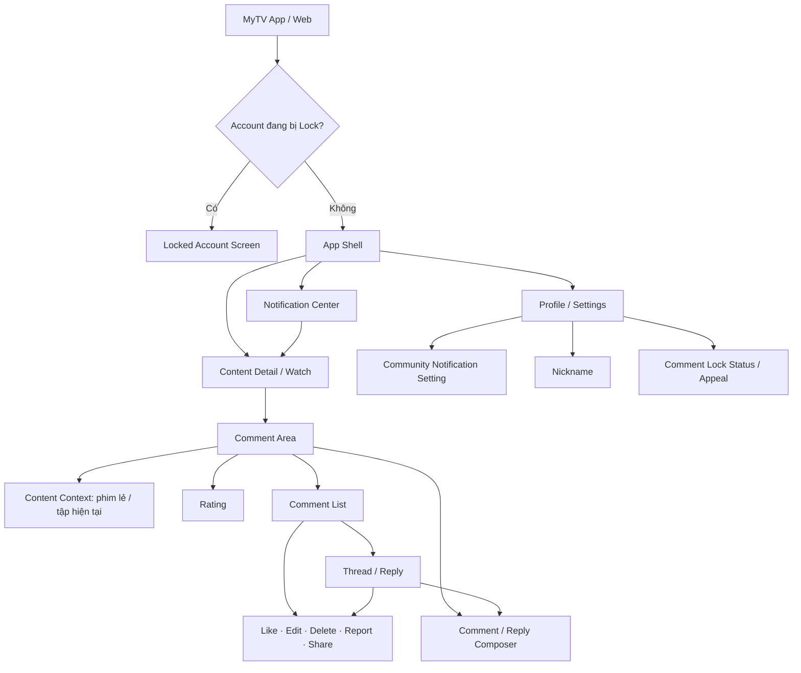
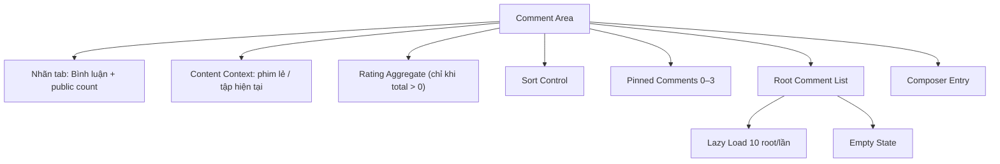
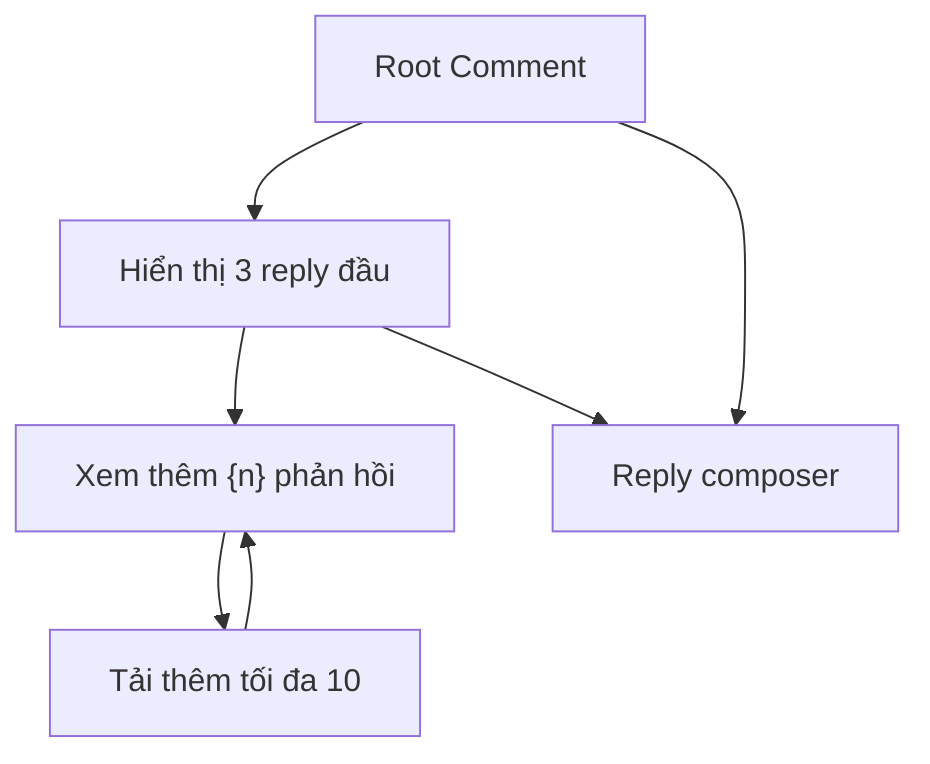
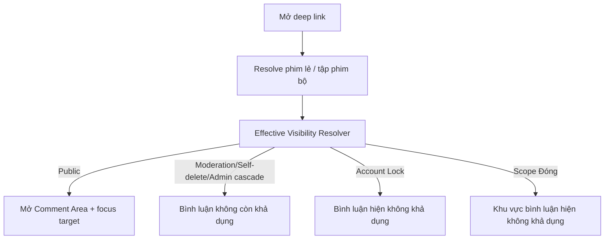
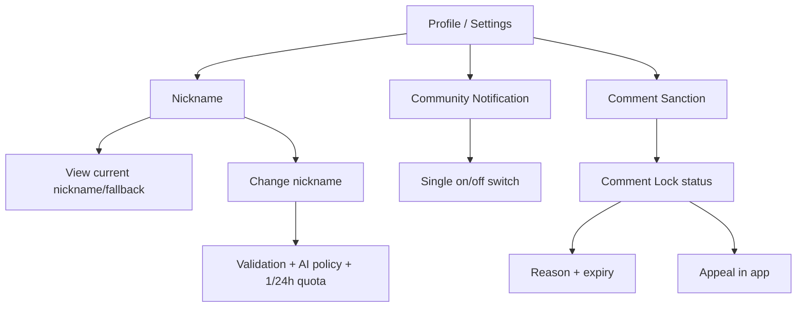
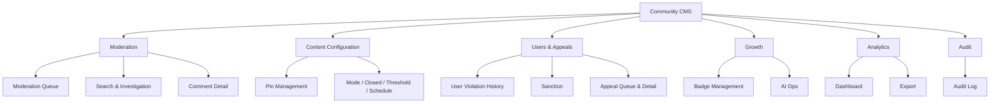
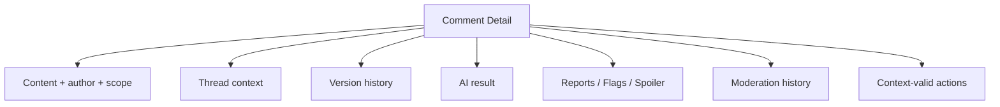
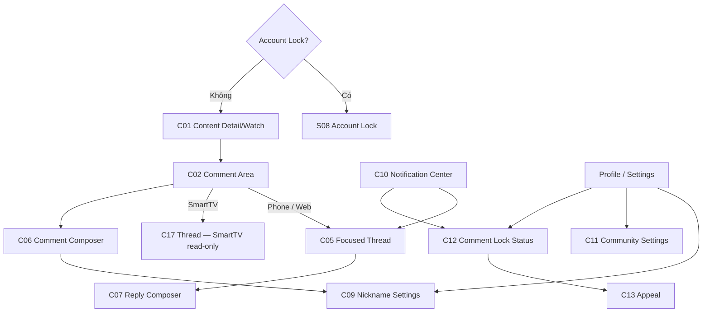
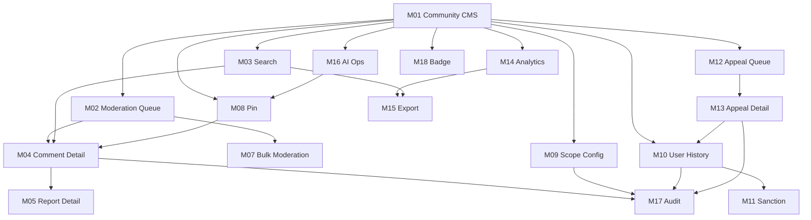

# UX Information Architecture & Screen Map — Tính năng Bình luận MyTV

**Phiên bản:** 1.0 · **Ngày:** 19/08/2026  
**Vai trò biên soạn:** UX Design  
**Baseline:** `main@dc0b5eade4aa8a647e2ec0bd201d780d3385877d`  
**Nguồn:** 20 User Story, `UX_USER_FLOWS.md`, `README.md`, `SOLUTION_ARCHITECTURE.md`, `REQUIREMENTS_A11Y_SECURITY.md`.

> Tài liệu này chuyển các User Flow đã khóa thành **Information Architecture (IA)** và **Screen Map (SM)** để làm cơ sở cho wireframe/prototype. Những cấu trúc điều hướng được ghi là **Đề xuất UX** khi backlog chưa quy định component/layout cụ thể; tài liệu không tự tạo business rule mới.

---

# 1. Mục tiêu IA & Screen Map

IA/SM phải bảo đảm 6 mục tiêu:

1. Người xem luôn hiểu mình đang thảo luận ở **phim lẻ nào, hoặc tập nào của phim bộ**.
2. Guest có thể đọc ngay, nhưng mọi interaction đi qua **auth gate** và quay lại đúng context.
3. Không có đường điều hướng nào làm lộ comment/thread đang non-public do moderation, cascade, Account Lock hoặc scope Đóng.
4. Các trạng thái moderation/sanction phải có **lối ra rõ ràng**, không tạo dead-end khó hiểu.
5. CMS phải phù hợp với mental model của Moderator/Admin: **Tìm → Hiểu context → Quyết định → Xác nhận → Audit**.
6. IA phải đủ ổn định để Web/Mobile/CMS dùng chung logic dù component/layout khác nhau.

---

# 2. Nguyên tắc kiến trúc thông tin

## IA-01 — Comment là nội dung theo ngữ cảnh, không phải một social feed độc lập

Trong scope hiện tại không có Community Home, global comment feed, profile feed hay discovery feed.

- Comment luôn thuộc **một phim lẻ hoặc một tập của phim bộ**.
- Deep link luôn quay về **phim/tập + comment/thread** nếu còn khả dụng.
- Khi target không còn xem được, user vẫn ở **phim/tập**, không rơi vào 404 comment page.

**Hệ quả UX:** Comment Area nằm trong trải nghiệm Content Detail/Watch; không tạo tab cấp ứng dụng tên “Cộng đồng” chỉ cho feature này.

## IA-02 — Không có scope Series phía người xem; context là phim lẻ hoặc tập hiện tại

Phía người xem **không tồn tại** phạm vi bình luận/rating “Toàn bộ phim/Series” và **không có** bộ chuyển scope Series ↔ Tập trên UI.

- **Phim lẻ:** comment và rating ở **cấp phim**.
- **Phim bộ:** comment và rating **chỉ theo tập đang xem**. Đổi tập là đổi **context nội dung**, không phải đổi scope trong cùng một Comment Area.
- Không tạo hai hệ thống comment độc lập ở navigation cấp app.
- Comment Area phải luôn cho user biết mình đang đọc/viết ở phim nào, tập nào.
- Khi đổi tập, count/rating/Pin/list reload theo tập mới và sort **reset về `Nổi bật`** (US02 AC3).
- **CMS vẫn giữ cấu hình cấp series** (mode/Đóng/threshold/schedule/Pin theo inheritance episode override → series override → default hệ thống, US15). Đây là **cấu hình vận hành**, hoàn toàn khác với scope bình luận của người xem — bỏ scope Series phía người xem **không** đồng nghĩa bỏ cấu hình CMS cấp series.

## IA-03 — State nội dung và gate hiển thị là hai lớp

IA/UI không được coi `moderation_state = Hiển thị` là đồng nghĩa “đang nhìn thấy”.

Render/deep link phải đi qua Effective Visibility Resolver:

1. Self-delete cascade.
2. Moderation state riêng.
3. Admin root moderation cascade.
4. Account Lock.
5. Scope Đóng.

## IA-04 — Account Lock nằm trên toàn bộ App Shell

Account Lock là access gate toàn tài khoản:

- Không cho user đi vào Home/Content/Notification/Settings.
- Login hoặc session bị vô hiệu hóa → **Locked Account Screen**.
- Màn này hiển thị status + reason + hotline `1800 1166` (miễn phí, 24/7).

Khóa bình luận thì khác: user vẫn vào app và vẫn dùng Like/Report/Rating/Share/self-delete theo rule.

## IA-05 — Tách “primary destination” và “task layer”

Một số thao tác không cần tạo màn hình độc lập:

- Sort → dropdown/bottom sheet.
- Report → sheet/dialog.
- Delete confirm → dialog.
- Moderation reason → action dialog/panel.
- Share → OS share sheet.

Điều này giúp IA không bị phình thành hàng chục “screen” chỉ vì mỗi action có một form nhỏ.

## IA-06 — CMS tổ chức theo job-to-be-done

Top-level IA CMS đề xuất:

1. **Moderation** — queue, search, comment detail, Report handling.
2. **Content Configuration** — Pin + Mode/Closed/Threshold/Schedule.
3. **Users & Appeals** — violation history, sanction, appeal.
4. **Growth** — Badge + AI Ops.
5. **Analytics** — KPI, Engagement, Export.
6. **Audit** — audit event/history.

---

# 3. IA tổng thể — Người xem MyTV

## 3.1. Primary destinations

### A. Content Detail / Watch

Đây là destination chính của feature Comment.

Chứa hoặc dẫn tới:

- Player/metadata nội dung hiện có.
- Comment Area.
- Rating.
- Context nội dung hiện tại: phim lẻ hoặc tập đang xem.
- Sort/Pin/list/thread.
- Comment/Reply composer.
- Deep-link target focus.

**Đã chốt (`UX_USER_FLOWS.md`):** Comment Area là **một tab riêng** trong trang nội dung, không phải block trôi nổi trên/dưới metadata. Phim bộ mặc định mở tab `Danh sách tập`, phim lẻ mặc định `Đề xuất`; user chủ động chọn tab `Bình luận ({count})`. Deep link comment/thread active thẳng tab `Bình luận`.

### B. Notification Center

Destination cấp app hiện có/đề xuất dùng để:

- Community notification: Reply, Mention, badge.
- Mandatory notification: moderation, sanction, appeal, Report result.

Notification item không mở một “comment screen” độc lập; nó deep-link về Content Detail/Watch hoặc sanction context tương ứng.

### C. Profile / Settings

Nhóm thông tin/tác vụ người dùng:

- Community notification setting.
- Nickname.
- Comment Lock status/appeal nếu đang có sanction.

**Đề xuất UX:** không tạo menu “Quản lý bình luận của tôi” trong MVP vì backlog chưa có User Story quản lý lịch sử toàn bộ comment cá nhân.

### D. Locked Account Screen

Nằm **ngoài App Shell**, ưu tiên cao hơn mọi destination khác.

User không thể đi vào app khi Account Lock còn hiệu lực.

---

# 4. IA chi tiết — Comment Area

## 4.1. Suggested information order

Đây là **thứ tự thông tin đề xuất**, không phải quyết định layout cứng:

1. Content context hiện tại (phim lẻ hoặc tập đang xem).
2. Rating aggregate chỉ hiển thị khi `total > 0`; rating đầu tiên dùng O11 sau khi player xác nhận xem xong.
3. Public comment count — hiển thị ở **nhãn tab** `Bình luận ({count})`, không phải header đếm riêng bên trong Comment Area.
4. Composer entry.
5. Sort control.
6. Pinned group.
7. Root comment list.
8. Load more/end state.

Lý do:

- Content context phải rõ trước khi user đánh giá/viết.
- Composer được nhìn thấy sớm để tăng khả năng tham gia.
- Pin là editorial layer và phải tách khỏi danh sách scoring để tránh hiểu nhầm thứ tự.

## 4.2. Comment Card IA

Một comment/reply card cần chứa tối thiểu các vùng thông tin:

- Identity: nickname/fallback mask + badge nếu có.
- Timestamp đăng + “Đã chỉnh sửa” nếu có.
- Moderation-visible state cho chính tác giả nếu cần.
- Text + Spoiler treatment; comment dài **truncate ở 3 dòng** rồi mới tới `Xem thêm` / `Thu gọn` (US01, đã chốt).
- Optional timestamp media context.
- Like + count.
- Reply action + reply count.
- Overflow actions phù hợp quyền: Edit/Delete/Report/Share.
- Pinned indicator nếu root đang được ghim.

**Không hiển thị:** Report count, reporter identity, moderation internals, AI risk cho cộng đồng.

## 4.3. Thread IA

- Reply depth luôn = 1.
- Reply vào reply vẫn lưu dưới root; có thể mention người được trả lời.
- Root non-public → thread không có destination độc lập.

---

# 5. Entry points — Người xem

| Entry | Destination | Context phải giữ |
|---|---|---|
| Mở Content Detail/Watch | Comment Area | phim lẻ hoặc tập hiện tại |
| Guest bấm Like/Reply/Comment/Rating/Report/Share | Auth Gate → quay lại Content | scope + thread + target comment + action origin |
| Notification Reply/Mention | Content + target | phim/tập/thread/comment |
| Notification moderation | Content hoặc moderation status | target + reason phù hợp |
| Notification badge | Content/Profile context | badge type |
| Share deep link | Content + target/fallback | phim/tập/thread/comment |
| Bấm timestamp | Player trong Content | episode + timecode |
| Comment Lock banner/status | Sanction detail/appeal | sanction reason + expiry |
| Login khi Account Lock | Locked Account Screen | sanction status + reason |

---

# 6. Deep-link IA

## 6.1. Conceptual route model

Đây là **mô hình thông tin**, không phải API/URL contract:

- Content route: `Phim lẻ` hoặc `Tập của phim bộ`.
- Optional thread target: `Root Comment`.
- Optional comment target: `Comment/Reply`.
- Optional source: `notification/share`.

## 6.2. Resolution

**UX rule:** fallback vẫn giữ content context và CTA quay về xem phim/tập; không hiển thị raw target data.

---

# 7. IA — Profile / Settings

## 7.1. Nickname entry point — Design decision

Backlog không khóa vị trí đổi nickname.

**Đề xuất:** có 2 entry cùng dẫn tới một destination:

1. Profile/Settings → Nickname.
2. Identity affordance trong Comment Composer → “Đổi tên hiển thị”.

Không tạo logic nickname riêng theo từng phim/tập vì nickname là identity toàn account.

---

# 8. IA — Notification

## 8.1. Logical groups

Notification Center có thể nhóm theo type nhưng không cần nhiều setting:

- Community:
  - Reply.
  - Mention.
  - Badge.
- Mandatory:
  - Moderation result.
  - Warning.
  - Comment Lock.
  - Appeal status.
  - Report result.

Account Lock không dựa vào Notification Center vì user không vào được app.

## 8.2. Notification item information

Tối thiểu:

- Event type.
- Safe actor identity nếu cần.
- Safe content context: tên phim/tập.
- Time.
- Read/unread.
- Deep-link target.

Không đưa Spoiler/raw comment/full PII vào push payload.

---

# 9. IA tổng thể — CMS

---

# 10. CMS IA — Moderation

## 10.1. Moderation Queue

Primary job: xử lý content cần moderation theo SLA.

Information hierarchy đề xuất:

1. Risk/SLA status.
2. Content preview an toàn.
3. Author identity + scope.
4. AI label.
5. Report/Flag/Spoiler indicators.
6. Wait time.
7. Primary actions theo state.

Default order: risk cao trước; cùng risk thì chờ lâu hơn trước.

## 10.2. Search & Investigation

Search/filter theo:

- Keyword.
- Nickname/account/định danh user.
- Series/Episode.
- Time.
- Moderation state.
- AI label.
- Report.
- Spoiler.

Kết quả phải giữ scope authorization.

## 10.3. Comment Detail

Đây là **decision workspace** của Moderator.

Action availability phải dựa trên state hiện tại; không hiển thị action vô nghĩa như “Duyệt” cho item đang Hiển thị.

---

# 11. CMS IA — Content Configuration

## 11.1. Pin Management

- Scope selector Series/Episode.
- Current pinned list 0–3.
- Drag/reorder.
- Expiry.
- Replace/unpin.
- Candidate comment selection/search.
- Audit reference.

## 11.2. Moderation Configuration

Một config workspace cần thể hiện đồng thời:

- Scope đang chỉnh: Series/Episode.
- Inheritance source: system / series / episode.
- Current effective mode.
- Proposed new mode.
- AI threshold.
- Effective time/timezone.
- Scheduled transition type.
- Confirmation summary trước Save.

**UX requirement:** người vận hành phải nhìn thấy **Before → After → Effective time** trước khi commit thay đổi.

---

# 12. CMS IA — Users & Appeals

## 12.1. User Violation History

Timeline nên kết hợp:

- Comment moderation.
- Report liên quan.
- Warning.
- Comment Lock.
- Account Lock.
- Appeal.
- Undo/status change.

Không trộn record user khác.

## 12.2. Sanction

Sanction action layer:

- Warning.
- Comment Lock.
- Account Lock.

Form cần:

- Type.
- Reason taxonomy.
- “Vi phạm khác” → note 1–500.
- Duration/preset/custom nếu áp dụng.
- Permanent chỉ cho Account Lock.
- Confirmation.

## 12.3. Appeals

Hai nguồn:

- Comment Lock → user gửi in-app.
- Account Lock → CSKH/Support ghi nhận vào CMS từ hotline.

Appeal workspace:

- Source.
- Sanction context.
- User statement/support note.
- Time received.
- SLA 48h/status.
- Decision: giữ/gỡ sanction.
- Audit.

---

# 13. CMS IA — Growth

## 13.1. Badge Management

Cần hỗ trợ phần Admin/Chuyên gia và badge config đã có trong US17:

- User lookup.
- Manual badge assign/revoke.
- Optional expiry.
- Badge type enable/disable.
- History/audit.

Auto badge Fan/Featured do system job; CMS chủ yếu inspect/config/audit, không biến thành manual calculation screen.

## 13.2. AI Ops

AI Ops gắn context phim/tập, không phải global AI chat.

Hai task:

1. Đề xuất comment đáng chú ý.
2. Đề xuất câu hỏi/chủ đề.

Admin luôn review trước pin/post.

---

# 14. CMS IA — Analytics

Dashboard hierarchy đề xuất:

1. Scope + time filter.
2. Last updated/freshness state.
3. KPI summary.
4. Engagement Score/ranking.
5. Interaction detail: Comment/Reply/Net Like/Rating/Share.
6. Safety: Report/confirmed rate/Hidden-Deleted-Rejected.
7. AI moderation performance.
8. Queue/SLA.
9. Export.

Empty/stale/error state phải là first-class UI state.

---

# 15. Screen Map — Người xem

## 15.1. Screen ID convention

- `Cxx` = Consumer/App-Web primary screen/view.
- `Oxx` = Overlay/Sheet/Dialog.
- `Sxx` = System/exception state.
- `Mxx` = CMS screen/workspace.

Một Screen ID có thể là **responsive destination dùng chung Web/Mobile**, không bắt buộc một file Figma duy nhất.

## 15.2. Consumer screen inventory

| ID | Screen / View | Loại | Platform | Entry chính | Exit / Next | US |
|---|---|---|---|---|---|---|
| C01 | Content Detail / Watch | Primary | Phone, Web, SmartTV | Browse, search, deep link | C02, player, app nav | US01, US06, US18 |
| C02 | Comment Area — populated | Contextual view | Phone, Web, SmartTV (TV read-only) | C01 | C05/C06/C08/O01/O04; TV → C17 | US01–US08 |
| C05 | Focused Thread / Deep-link target | Context state | Phone, Web (TV dùng C17) | Notification/share/list | C02, C07/C08/actions | US01, US08, US09, US18 |
| C06 | Comment Composer | Task view | Phone (bottom sheet), Web (inline) | C02 | C02 pending/public/error | US04, US06, US11 |
| C07 | Reply Composer | Task view | Phone (bottom sheet), Web (inline) | C05 | C05 pending/public/error | US08, US09, US11 |
| C08 | Rating interaction state | Component state | Phone, Web, SmartTV | C02 | C02 | US03 |
| C09 | Nickname Settings | Secondary | Phone, Web | Profile hoặc composer identity | previous screen | US04, US11 |
| C10 | Notification Center | Primary/secondary | Phone, Web | App shell | C01/C05/C13 | US09, US10, US14, US16, US17 |
| C11 | Community Notification Settings | Secondary | Phone, Web | Profile/Settings | Profile | US09 |
| C12 | Comment Lock Status | Secondary/status | Phone, Web | banner/notification/Profile | C13 hoặc previous | US16 |
| C13 | Comment Lock Appeal | Task | Phone, Web | C12 | C12 confirmation/status | US16 |
| C14 | Moderation Result Detail | Status/context | Phone, Web | mandatory notification | C01/C05 | US12, US14 |
| C15 | Badge feedback/context | Status | Phone, Web (TV chỉ hiển thị icon + tên) | notification/profile/comment identity | source context | US17 |
| C16 | Share Deep-link Landing | Route state | Phone, Web | external link | C01/C05/S03–S05 | US18 |
| C17 | Thread — SmartTV read-only | Primary (TV) | SmartTV | C02 trên TV: chọn root comment | quay lại C02; không có Reply composer | US01, US08 |

SmartTV không có destination tạo nội dung: C06, C07, O03–O06, O08, O09, O10 không render trên TV; thay bằng state S13 (hướng dẫn + QR chuyển sang smartphone).

## 15.3. Consumer overlays / sheets

| ID | Overlay | Platform | Entry | Outcome | US |
|---|---|---|---|---|---|
| O01 | Auth Gate | Phone, Web, SmartTV | Guest interaction (TV: Like/Rating) | Login → return context / cancel | US01, US03, US04, US07, US08, US10, US18 |
| O02 | Sort selector | Phone, Web, SmartTV (remote) | C02 | Nổi bật/Mới nhất/Nhiều lượt thích | US02 |
| O03 | Comment action menu | Phone, Web | comment/reply overflow | Edit/Delete/Report/Share theo quyền | US05, US10, US18 |
| O04 | Edit Comment/Reply | Phone, Web | O03 | submit version / validation/error | US05, US11 |
| O05 | Delete confirmation | Phone, Web | O03 | self-delete / cancel | US05 |
| O06 | Report sheet | Phone, Web | O03 | submit report / cooldown/rate-limit | US10 |
| O07 | Spoiler reveal | Phone, Web, SmartTV | comment body | reveal content | US04, US08 |
| O08 | Timestamp input/edit | Phone, Web | composer | attach one timestamp | US06 |
| O09 | Mention suggestion | Phone, Web | composer after `@` | select account ID | US09 |
| O10 | OS Share Sheet | Phone, Web | Share action | successful open or successful copy fallback = Share event | US18 |
| O11 | Post-watch Rating Prompt | Phone, Web, SmartTV | Player phát `content_completed` khi đạt 90% duration hoặc end-of-content event, lần đầu trong phiên xem, **và scope không ở trạng thái Đóng bình luận** | Chọn 1–5 sao và lưu đúng content scope; seek đơn thuần không kích hoạt; không tạo scope Series; SmartTV dùng biến thể điều hướng remote | US03, US12 |

## 15.4. System/exception states

| ID | State | Platform | Trigger | User-facing behavior | US |
|---|---|---|---|---|---|
| S01 | Comment Area Loading | Phone, Web, SmartTV | mở tab Bình luận / đổi tập / đổi sort | skeleton/progress | US01, US02 |
| S02 | Comment Area Empty | Phone, Web, SmartTV | no public data | guest CTA login / logged-in CTA viết đầu tiên / SmartTV hướng dẫn + QR (S13) | US01 |
| S03 | Target no longer available | Phone, Web, SmartTV | moderation/self-delete/admin cascade | “Bình luận không còn khả dụng” (target hiện không khả dụng; self-delete không Undo, Admin root delete có thể Undo trong 90 ngày theo lifecycle) | US12, US18 |
| S04 | Target temporarily unavailable | Phone, Web, SmartTV | Account Lock của tác giả/root author | “Bình luận hiện không khả dụng” (tạm thời; link hoạt động lại sau khi gỡ khóa) | US12, US16, US18 |
| S05 | Comment Area closed | Phone, Web, SmartTV | scope Đóng | giữ tab `Bình luận` nhưng **bỏ count**; hiển thị “Khu vực bình luận hiện không khả dụng”; ẩn rating/list/composer/actions | US01, US12, US18 |
| S06 | Pending moderation — author only | Phone, Web | Comment/Reply/Edit pending | status visible only to author | US04, US05, US11, US12 |
| S07 | Comment Lock interaction blocked | Phone, Web | Comment/Reply/Mention/Edit after lock | explain sanction + allowed alternatives | US16 |
| S08 | Account Lock full-screen | Phone, Web, SmartTV | login/session effective lock | reason + hotline; no App Shell | US09, US16 |
| S09 | Like reconcile error | Phone, Web, SmartTV | server mismatch/fail | revert + announce + retry | US07 |
| S10 | Timestamp unavailable | Phone, Web, SmartTV | media/time invalid/unavailable | disabled timestamp + fallback | US06 |
| S11 | Report cooldown | Phone, Web | same target <24h | remaining time | US10 |
| S12 | Report rate limit | Phone, Web | >10 Report trong rolling 60 phút/user | retry countdown | US10 |
| S13 | SmartTV — không hỗ trợ tạo nội dung | SmartTV | user muốn Comment/Reply/Mention/Report/Share trên TV | ẩn entry tạo nội dung; hiển thị **hướng dẫn + QR** để chuyển sang smartphone; vẫn giữ đọc/Like/Rating/Sort/Spoiler/Timestamp | US01, US04, US09, US10, US18 |
| S14 | Rate limit Comment/Reply | Phone, Web | >5 attempt Comment/Reply trong rolling 60 giây/user (quota chung; attempt tính cả lần bị AI chặn) | “Bạn đang bình luận hơi nhanh”; không gọi AI, không tạo record; cho gửi lại sau | US04, US08, US11 |
| S15 | Edit rate limit | Phone, Web | >5 lần sửa trong rolling 60 giây/target | chặn trước khi tạo version mới/gọi AI; giữ nội dung đang soạn; cho thử lại | US05, US11 |
| S16 | Nickname bị chặn tại submit | Phone, Web | validation/AI chặn, hoặc AI không cho quyết định hợp lệ | “Tên này chưa phù hợp”; giữ nickname cũ/fallback mask; cho thử tên khác; không Pending, không tiêu quota | US04, US11 |
| S17 | Nickname hết quota 24h | Phone, Web | đã có 1 lần đổi nickname thành công trong 24 giờ | chặn submit đổi nickname và cho biết phải chờ hết chu kỳ 24 giờ *(microcopy chưa có trong backlog)* | US04 |

---

# 16. Consumer Screen Map — navigation

---

# 17. Screen Map — CMS

## 17.1. CMS screen inventory

| ID | Screen / Workspace | Entry | Next | US |
|---|---|---|---|---|
| M01 | Community CMS Landing | CMS nav | M02/M03/M08/M10/M14/M16/M18 | Cross-cutting |
| M02 | Moderation Queue | M01 | M04/M05/M06/M07 | US11–US14 |
| M03 | Search & Investigation | M01 | M04/M10/M15 | US13 |
| M04 | Comment Detail | queue/search | M05/M06/M10/M17 | US13, US14 |
| M05 | Report / Flag / Spoiler Detail | M04/M02 | M06 / close report | US10, US14 |
| M06 | Single Moderation Action | M04/M05 | M04 result | US14 |
| M07 | Bulk Moderation | M02/M03 selection | result summary | US14 |
| M08 | Pin Management | M01 content config | M04/M09 | US15 |
| M09 | Scope Moderation Configuration | M01 content config | confirm/save/history | US11, US12, US15 |
| M10 | User Violation History | M03/M04/Users nav | M11/M12/M17 | US16 |
| M11 | Sanction Action | M10 | M10/locked status | US16 |
| M12 | Appeal Queue | M01 Users & Appeals | M13 | US16 |
| M13 | Appeal Detail | M12/M10 | decision → M10/M12 | US16 |
| M14 | Analytics Dashboard | M01 | M15 | US19 |
| M15 | Export Configuration/Result | M03/M14 | download/result | US13, US19 |
| M16 | AI Ops Workspace | M01 Growth hoặc content context | M08 / Post proposal | US20 |
| M17 | Audit History | M04/M09/M10/M13/global Audit | source context | US14–US17 |
| M18 | Badge Management | M01 Growth | M10/M17 | US17 |
| M19 | AI Policy / Threshold Config | M09/global config entry | M17 | US11, US15 |

## 17.2. CMS overlays / dialogs

| ID | Overlay | Trigger | Nội dung chính |
|---|---|---|---|
| MO01 | Moderation reason dialog | Reject/Hide/Delete | taxonomy + optional/required note |
| MO02 | Delete confirmation | Delete | target/thread impact |
| MO03 | Undo confirmation | Undo | before/after state |
| MO04 | Bulk reason/override | bulk Reject/Hide/Delete | batch reason + per-item override |
| MO05 | Partial-success result | bulk finish | success/failure per item |
| MO06 | Pin replace/expiry | pin action | position + expiry/replace |
| MO07 | Config change confirmation | save mode/threshold/schedule | effective source + before/after/time |
| MO08 | Sanction confirmation | Warning/Lock | type + reason + duration/permanent |
| MO09 | Export PII opt-in | export | include-PII explicit confirmation |
| MO10 | AI proposal review | AI Ops | rationale + edit/accept/discard |

---

# 18. CMS Screen Map — navigation

---

# 19. Screen → User Story coverage matrix

| US | Primary Consumer | CMS / System |
|---|---|---|
| US01 Đọc bình luận | C01, C02, C05, C17, O01, S01–S05, S13 | — |
| US02 Content context/count/sort | C02, C05, C17, O02, S01 | — |
| US03 Rating | C02, C08, O01, O11 | M14 analytics |
| US04 Đăng comment | C06, C09, O07/O08, S13/S14/S16/S17 | M02/M04 moderation |
| US05 Edit/Delete | O03/O04/O05, S06/S07/S15 | M04/M06/M17 |
| US06 Timestamp | C06/C07, O08, S10, C01 player | — |
| US07 Like | C02/C05, S09, O01 | M14 analytics |
| US08 Reply | C05/C07, C17, O09, S13/S14 | M04 thread context |
| US09 Mention/Notification | C07, O09, C10/C11, S13 | — |
| US10 Report | O06, S11/S12/S13, C10 | M05/M04 |
| US11 AI moderation | C09, S06/S14/S15/S16 + composer outcomes | M02/M04/M09/M19 |
| US12 Visibility/state | S03–S06 | M04/M09/M17 |
| US13 CMS search/export | — | M03/M04/M15 |
| US14 CMS moderation | C14 + mandatory notification | M04–M07/M17 |
| US15 Pin/config | C02 pinned group | M08/M09/M19 |
| US16 Sanction/appeal | C12/C13/S07/S08 | M10–M13/M17 |
| US17 Badge | C15 + identity badge | M18/M14/M17 |
| US18 Share | O10/C16/S03–S05, S13 | M14 analytics |
| US19 Analytics | — | M14/M15 |
| US20 AI Ops | — | M16/M08 |

**Coverage check:** 20/20 User Story đều có destination/state tương ứng.

---

# 20. State model dùng cho wireframe

Mỗi primary screen nên được thiết kế ít nhất với các state sau khi applicable:

1. Default / populated.
2. Loading.
3. Empty.
4. Validation error.
5. Network/server error.
6. Permission/auth gate.
7. Pending moderation.
8. Non-public fallback.
9. Rate-limit/cooldown.
10. Disabled by scope/sanction.
11. Success/confirmation.
12. Stale/conflict/reconcile.

Không cần mọi screen có đủ 12 state; wireframe checklist phải xác định state nào áp dụng.

---

# 21. Responsive behavior — nguyên tắc, chưa chốt layout

## Mobile (Phone)

- Task ngắn ưu tiên bottom sheet/full-screen sheet: sort, Report, action menu, reason.
- **Đã chốt:** Comment/Reply composer trên Phone là **bottom sheet**, không phải task screen riêng; phải giữ context nội dung hiện tại.
- Deep-link target cần scroll + focus/announcement.

## Web

- **Đã chốt:** Comment/Reply composer trên Web là **inline** trong Comment Area/thread.
- Task layer có thể dùng popover/dialog/side panel nếu không làm mất context.
- CMS ưu tiên table/list + detail panel hoặc split-view khi phù hợp.
- Keyboard navigation/focus indicator bắt buộc.

## SmartTV / 10-foot UI

- SmartTV **không tạo nội dung**: không Comment, Reply, Mention, Report, Share. Không render composer entry (C06/C07) và các overlay tạo nội dung (O03–O06, O08, O09, O10).
- SmartTV **vẫn hỗ trợ**: đọc comment/thread, Like/Unlike, Rating 1–5 sao, đổi Sort, reveal Spoiler và bấm Timestamp để seek — tất cả bằng remote. Like/Rating vẫn yêu cầu login (O01).
- Khi user muốn tham gia bình luận, TV hiển thị **hướng dẫn + QR** để chuyển sang smartphone (state `S13`). Empty state trên TV cũng dùng hướng dẫn + QR thay cho CTA viết bình luận đầu tiên (US01).
- Thread trên TV **không expand inline** mà mở **trang thread riêng chỉ đọc** (`C17`, US08); không có Reply composer trong màn này.
- Badge trên TV chỉ hiển thị icon + tên, không mở badge detail (US17).
- Navigation theo D-pad/remote: focus order tuyến tính, focus indicator rõ ràng, không phụ thuộc hover/touch; lazy load và đổi sort phải thao tác được bằng remote (US02).
- Account Lock áp dụng cho mọi platform gồm SmartTV; appeal Account Lock qua hotline `1800 1166` (US16).

**Không khóa ở IA:** breakpoint, pixel width, side-panel vs full-page cụ thể, kích thước/vị trí QR trên TV.

---

# 22. Navigation rules quan trọng

1. Login return giữ target context nhưng **không giữ pending action để auto-submit**.
2. Phim bộ đổi tập → reload toàn bộ dữ liệu của tập mới (count/rating/Pin/list), không carry list cũ. Phía người xem không có thao tác đổi scope Series↔Tập.
3. Sort preference chỉ áp dụng cho content context hiện tại và **không persist sang context khác**: phim bộ đổi tập → **sort reset về `Nổi bật`** cùng lúc reload rating/public count/Pin/list của tập mới (US02 AC3).
4. Deep link public → focus đúng target.
5. Deep link non-public → content context + fallback, không lộ target.
6. Account Lock → chặn toàn App Shell.
7. Comment Lock → không chặn App Shell; chỉ chặn Comment/Reply/Mention/Edit.
8. CMS state change thành công → refresh current state và invalid action availability.
9. Bulk partial success → giữ user ở result/context để xử lý item lỗi, không báo thành công toàn bộ.
10. Undo không được mô tả như “restore mọi thứ”: Pin/Featured badge có lifecycle riêng.

---

# 23. IA decisions đã đủ cơ sở để bắt đầu wireframe

Các quyết định sau có thể coi là **UX structure baseline**:

- Không có Community Home/global feed trong MVP.
- Comment nằm trong Content Detail/Watch context.
- Không có scope selector Series↔Tập phía người xem; context của Comment Area là phim lẻ hoặc tập đang xem. CMS vẫn cấu hình được ở cấp series.
- Notification là destination cấp app; comment target vẫn quay về content context.
- Profile/Settings chứa nickname + community notification + Comment Lock status/appeal.
- Account Lock nằm ngoài App Shell.
- CMS dùng 6 nhóm job: Moderation / Content Config / Users & Appeals / Growth / Analytics / Audit.
- Comment Detail là decision workspace chính của CMS.
- Deep link không tạo isolated comment page.

---

# 24. Design Decisions cần chốt trong wireframe

Đây là quyết định UX/UI, **không phải blocker business rule**:

1. Pending comment của tác giả nằm inline theo vị trí thời gian hay khu riêng “Đang chờ duyệt”.
2. Comment action menu dùng kebab/context menu hay action row.
3. Notification Center có group/tab “Cộng đồng” vs “Hệ thống” hay chỉ một feed với type label.
4. Comment Lock status hiển thị banner toàn app hay chỉ trong Comment Area/Profile.
5. Nickname shortcut có xuất hiện trong composer hay chỉ ở Profile.
6. CMS Moderation dùng table + right panel hay list → full detail page.
7. Search & Queue là hai navigation item hay một screen có saved filters.
8. Reports có tab riêng trong Moderation hay chỉ filter + detail context.
9. Pin/Config chung một Content Operations page hay hai subpage.
10. Appeal Queue nằm dưới Users hay Moderation Ops.
11. Analytics KPI card order và default time range.
12. AI Ops nằm trong từng Content Detail CMS hay menu Growth rồi chọn scope.

Các điểm sau **đã được chốt ở nơi khác** nên không còn nằm trong danh sách này: vị trí Comment Area (tab riêng trong trang nội dung — `UX_USER_FLOWS.md`), composer Phone = bottom sheet / Web = inline (`UX_USER_FLOWS.md`), truncate comment dài **3 dòng** trước `Xem thêm`/`Thu gọn` (US01), và bộ chuyển Series↔Tập phía người xem (đã bỏ hẳn — xem IA-02).

---

# 25. Wireframe priority map

## P0 — Core consumer loop

Wireframe trước:

- C01 Content Detail/Watch + C02 Comment Area (tab `Bình luận ({count})`).
- Sort/Pin/List/Thread.
- C06/C07 Composer.
- Auth Gate.
- Fallback states: `S06` Pending · `S05` scope Đóng (giữ tab `Bình luận`, bỏ count) · `S03` Target no longer available (“Bình luận không còn khả dụng”) · `S04` Account Lock target (“Bình luận hiện không khả dụng”) — S03 và S04 phải là **hai frame riêng** vì microcopy và lifecycle semantics khác nhau; S03 không mặc định vĩnh viễn vì Admin root delete có thể Undo trong 90 ngày.
- Edit/Delete/Report.
- `C09` Nickname Settings + state `S16` nickname bị chặn tại submit và `S17` hết quota 24h (US04/US11 nằm trong P0).
- Rate-limit states `S14` (Comment/Reply 5 attempt/rolling 60 giây/user) và `S15` (Edit 5 lần/rolling 60 giây/target).
- SmartTV: biến thể read-only của `C02`, màn `C17` thread read-only và state `S13` (hướng dẫn + QR chuyển sang smartphone).

Bao phủ US01, US02, US04, US05, US08, US10, US11, US12.

## P1 — Community interaction

- Rating: khối aggregate trong `C02` (**chỉ render khi `total > 0`**) + `C08` rating interaction state + `O11` Post-watch Rating Prompt (Phone/Web + biến thể remote cho SmartTV). Khi `total = 0` tab không có khối rating và không có empty-state, nên `O11` là đường vào duy nhất của rating đầu tiên — không được bỏ khỏi đợt vẽ.
- Like optimistic/reconcile.
- Timestamp.
- Mention.
- Notification Center.
- Share/deep link.

Bao phủ US03, US06, US07, US09, US18.

## P2 — Sanction & growth consumer

- Comment Lock status/appeal.
- Account Lock screen.
- Badge state/notification.

Bao phủ US16, US17.

## P0 CMS — Safe launch dependency

- Moderation Queue.
- Search.
- Comment Detail.
- Single moderation action.
- Bulk moderation.
- Scope config.

Bao phủ US11–US15.

## P1 CMS — Operations

- User history.
- Sanction.
- Appeal.
- Pin management.
- Audit.
- Analytics.

## P2 CMS — Growth

- Badge management.
- AI Ops.

---

# 26. Handoff checklist cho Wireframe/Figma

Mỗi screen/frame trong Figma nên gắn metadata tối thiểu:

- Screen ID từ tài liệu này.
- User Story liên quan.
- Platform: Phone / Web / SmartTV (theo cột Platform ở mục 15).
- Actor/role.
- Entry point.
- Primary task.
- State đang thể hiện.
- Next/exit.
- Visibility/auth assumption.
- Accessibility note nếu có.

Ví dụ:

`C05 · US08/US09 · Phone/Web · Logged-in · Deep-linked thread · Public · Reply available`

`C17 · US08 · SmartTV · Logged-in/Guest · Thread read-only · Public · Không có Reply`

Điều này giúp Design/Dev/QA đối chiếu cùng một screen mà không dựa vào tên frame tự do.

---

# 27. Technical refinement note — đã chốt

Điểm tồn đọng cũ về **Nickname AI timeout** trong `US11` **đã được PO chốt** và wording của US11 **đã được normalize**: nickname **không bao giờ** có trạng thái Chờ duyệt. AI timeout >5 giây / lỗi 5xx / dịch vụ AI không khả dụng, nickname ngoài tiếng Việt–tiếng Anh và AI low-confidence đều xử lý **giống nhau**: chặn + cho thử lại, **không tạo queue item**, **không tiêu quota** 1 lần đổi thành công/24 giờ.

Khẳng định sau vẫn giữ nguyên hiệu lực: IA/Screen Map này **không tạo Nickname Pending screen/state**. Khi AI chưa có decision hợp lệ:

- nickname mới không được đổi/public;
- nickname cũ/fallback (mask số điện thoại nếu chưa từng có nickname hợp lệ) tiếp tục hiển thị;
- user nhận error/retry state phù hợp — state `S16` trong mục 15.4.

---

## Kết luận

IA đề xuất giữ feature Comment **contextual, lean và an toàn**:

- Người xem luôn bắt đầu từ nội dung phim/tập.
- Interaction được layer vào Comment Area thay vì tạo social product độc lập.
- Exception flow (moderation, scope Đóng, Account Lock) là first-class state.
- CMS được tổ chức theo job vận hành, không theo cấu trúc backend service.

`UX_USER_FLOWS.md` là source-of-truth cho **flow logic**; tài liệu này là source-of-truth cho **navigation hierarchy + screen inventory** khi bắt đầu wireframe.
