# UX User Flows — Tính năng Bình luận MyTV

**Phiên bản:** 1.0 · **Ngày:** 19/08/2026  
**Vai trò biên soạn:** UX Design  
**Baseline đã review:** `main@eab90c3659fce47a034da0e9ee4341a9c580107a`  
**Nguồn:** 20 User Story hiện hành, `README.md`, `SOLUTION_ARCHITECTURE.md`, `REQUIREMENTS_A11Y_SECURITY.md`.

> Mục tiêu của tài liệu này là chuyển Acceptance Criteria/Business Rule thành **luồng trải nghiệm có thể dùng để wireframe, prototype, design review và handoff Dev/QA**. Tài liệu **không tự chốt layout/component** ở những điểm backlog chưa quy định.

---

## 0. Nguyên tắc UX dùng chung

1. **Mở để đọc — đăng nhập để tương tác.** Guest được đọc nội dung public; mọi interaction yêu cầu login. Sau login quay lại đúng context nhưng **không tự chạy action cũ**.
2. **Effective Visibility Resolver là nguồn chân lý khi render/deep link.** UX không suy luận chỉ từ `moderation_state`.
3. **State nội dung và gate hiển thị là hai lớp khác nhau.** Account Lock hoặc scope Đóng có thể làm content non-public mà không đổi moderation state.
4. **Không lộ nội dung/PII qua empty/error/fallback state.** Deep link tới target không còn xem được phải mở đúng phim/tập và dùng fallback tương ứng.
5. **WCAG 2.1 AA là mặc định.** Touch target ≥44×44pt, keyboard/focus đầy đủ, trạng thái không truyền đạt chỉ bằng màu.
6. **Sau login/deep link phải phục hồi ngữ cảnh.** Nếu target còn hợp lệ, scroll + set focus vào đúng comment/thread; không chỉ scroll bằng mắt.
7. **Optimistic UI phải có đường reconcile rõ.** Trạng thái server là source of truth, thay đổi bị revert cần được announce/giải thích.
8. **Các flow CMS luôn có authorization theo scope ở server.** UI không được tạo cảm giác rằng item ngoài quyền có thể thao tác.

### Legend

- **User**: người xem/người dùng MyTV.
- **Guest**: người chưa đăng nhập.
- **Admin/Moderator**: người vận hành CMS theo scope được cấp.
- **System**: service/backend/pipeline.
- **Gate**: điều kiện có thể làm nội dung không public mà không nhất thiết đổi moderation state.

---

# EP01 — Trải nghiệm bình luận và đánh giá

## US01 — Đọc khu vực bình luận

**Actor:** Guest hoặc User đã đăng nhập  
**Entry:** Trang chi tiết/xem phim, hoặc deep link tới comment/thread.

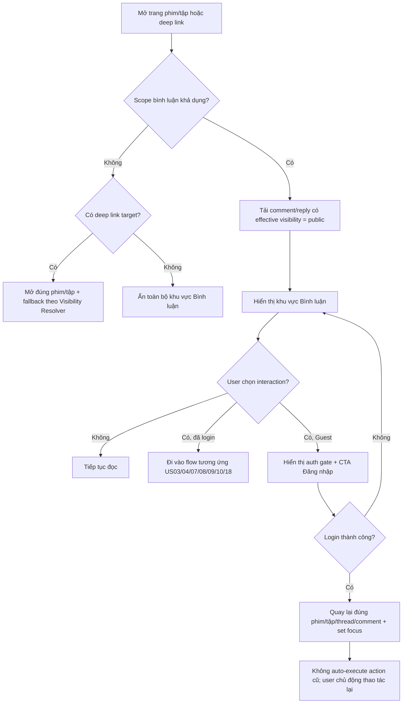
```mermaid
flowchart TD
    A["Mở trang phim/tập hoặc deep link"] --> B{"Scope bình luận khả dụng?"}
    B -->|Không| C{"Có deep link target?"}
    C -->|Có| D["Mở đúng phim/tập + fallback theo Visibility Resolver"]
    C -->|Không| E["Ẩn toàn bộ khu vực Bình luận"]
    B -->|Có| F["Tải comment/reply có effective visibility = public"]
    F --> G["Hiển thị khu vực Bình luận"]
    G --> H{"User chọn interaction?"}
    H -->|Không| I["Tiếp tục đọc"]
    H -->|Có, đã login| J["Đi vào flow tương ứng US03/04/07/08/09/10/18"]
    H -->|Có, Guest| K["Hiển thị auth gate + CTA Đăng nhập"]
    K --> L{"Login thành công?"}
    L -->|Không| G
    L -->|Có| M["Quay lại đúng phim/tập/thread/comment + set focus"]
    M --> N["Không auto-execute action cũ; user chủ động thao tác lại"]
```

**UX states bắt buộc:** loading list, empty guest, empty logged-in, auth gate theo action, closed-scope fallback, removed/non-public target fallback.  
**A11y:** sau login/deep link set focus vào target; interaction phải dùng keyboard được.

---

## US02 — Xem theo Series/Tập, số lượng và sắp xếp

**Actor:** mọi người xem  
**Entry:** Khu vực Bình luận đang khả dụng.

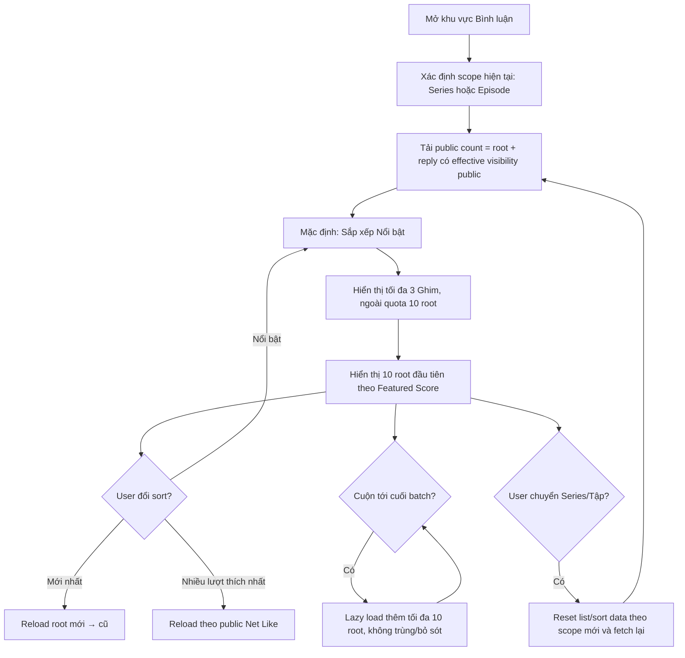
```mermaid
flowchart TD
    A["Mở khu vực Bình luận"] --> B["Xác định scope hiện tại: Series hoặc Episode"]
    B --> C["Tải public count = root + reply có effective visibility public"]
    C --> D["Mặc định: Sắp xếp Nổi bật"]
    D --> E["Hiển thị tối đa 3 Ghim, ngoài quota 10 root"]
    E --> F["Hiển thị 10 root đầu tiên theo Featured Score"]
    F --> G{"User đổi sort?"}
    G -->|Mới nhất| H["Reload root mới → cũ"]
    G -->|Nhiều lượt thích nhất| I["Reload theo public Net Like"]
    G -->|Nổi bật| D
    F --> J{"Cuộn tới cuối batch?"}
    J -->|Có| K["Lazy load thêm tối đa 10 root, không trùng/bỏ sót"]
    K --> J
    F --> L{"User chuyển Series/Tập?"}
    L -->|Có| M["Reset list/sort data theo scope mới và fetch lại"]
    M --> C
```

**UX states bắt buộc:** loading/skeleton khi đổi scope, empty per scope, loading-more, end-of-list, sort menu/select.  
**Design decision còn mở:** component cụ thể để chuyển Series ↔ Episode chưa được backlog quy định.

---

## US03 — Đánh giá Series/Tập bằng 5 sao

**Actor:** Guest xem aggregate; User đăng nhập tạo/sửa/xóa rating.

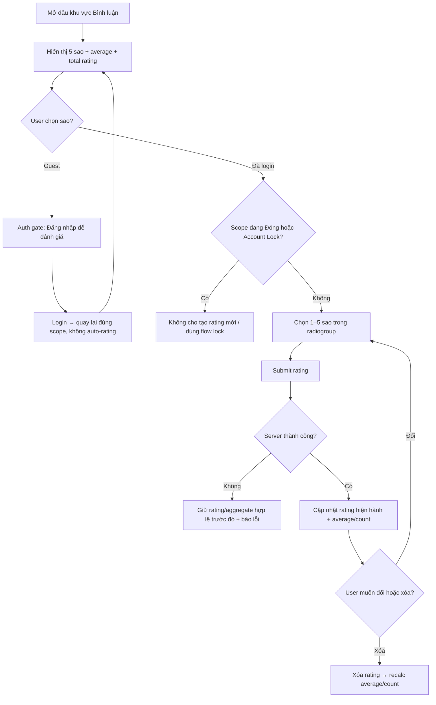
```mermaid
flowchart TD
    A["Mở đầu khu vực Bình luận"] --> B["Hiển thị 5 sao + average + total rating"]
    B --> C{"User chọn sao?"}
    C -->|Guest| D["Auth gate: Đăng nhập để đánh giá"]
    D --> E["Login → quay lại đúng scope, không auto-rating"]
    E --> B
    C -->|Đã login| F{"Scope đang Đóng hoặc Account Lock?"}
    F -->|Có| G["Không cho tạo rating mới / dùng flow lock"]
    F -->|Không| H["Chọn 1–5 sao trong radiogroup"]
    H --> I["Submit rating"]
    I --> J{"Server thành công?"}
    J -->|Không| K["Giữ rating/aggregate hợp lệ trước đó + báo lỗi"]
    J -->|Có| L["Cập nhật rating hiện hành + average/count"]
    L --> M{"User muốn đổi hoặc xóa?"}
    M -->|Đổi| H
    M -->|Xóa| N["Xóa rating → recalc average/count"]
```

**UX states bắt buộc:** selected rating, update rating, remove rating, submit error.  
**A11y:** `radiogroup`; phím trái/phải; mỗi option có label “{n} sao”.

---

## US04 — Đăng bình luận

**Actor:** User đăng nhập.

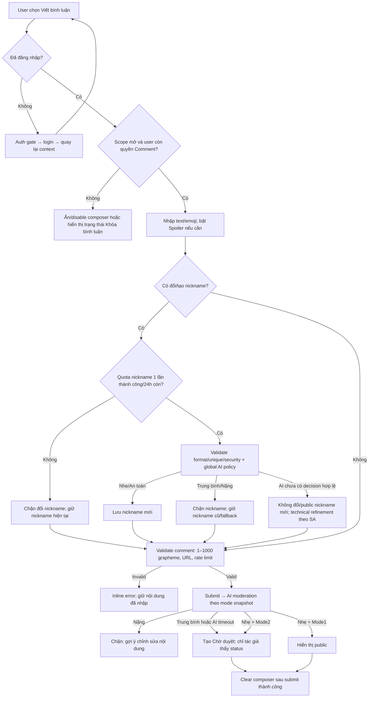
```mermaid
flowchart TD
    A["User chọn Viết bình luận"] --> B{"Đã đăng nhập?"}
    B -->|Không| C["Auth gate → login → quay lại context"]
    C --> A
    B -->|Có| D{"Scope mở và user còn quyền Comment?"}
    D -->|Không| E["Ẩn/disable composer hoặc hiển thị trạng thái Khóa bình luận"]
    D -->|Có| F["Nhập text/emoji; bật Spoiler nếu cần"]
    F --> G{"Có đổi/tạo nickname?"}
    G -->|Có| H{"Quota nickname 1 lần thành công/24h còn?"}
    H -->|Không| I["Chặn đổi nickname; giữ nickname hiện tại"]
    H -->|Có| J["Validate format/unique/security + global AI policy"]
    J -->|Nhẹ/An toàn| K["Lưu nickname mới"]
    J -->|Trung bình/Nặng| L["Chặn nickname; giữ nickname cũ/fallback"]
    J -->|AI chưa có decision hợp lệ| M["Không đổi/public nickname mới; technical refinement theo SA"]
    G -->|Không| N["Validate comment: 1–1000 grapheme, URL, rate limit"]
    K --> N
    I --> N
    L --> N
    M --> N
    N -->|Invalid| O["Inline error; giữ nội dung đã nhập"]
    N -->|Valid| P["Submit → AI moderation theo mode snapshot"]
    P -->|Nặng| Q["Chặn; gợi ý chỉnh sửa nội dung"]
    P -->|Trung bình hoặc AI timeout| R["Tạo Chờ duyệt; chỉ tác giả thấy status"]
    P -->|Nhẹ + Mode2| R
    P -->|Nhẹ + Mode1| S["Hiển thị public"]
    R --> T["Clear composer sau submit thành công"]
    S --> T
```

**UX states bắt buộc:** composer default, spoiler on/off, validation error, rate-limit, AI blocked, pending moderation, success, network error giữ draft.  
**A11y/Security:** spoiler phải che cả với screen reader trước reveal; sanitize độc lập với AI.

---

## US05 — Sửa và xóa bình luận

**Actor:** tác giả Comment/Reply.

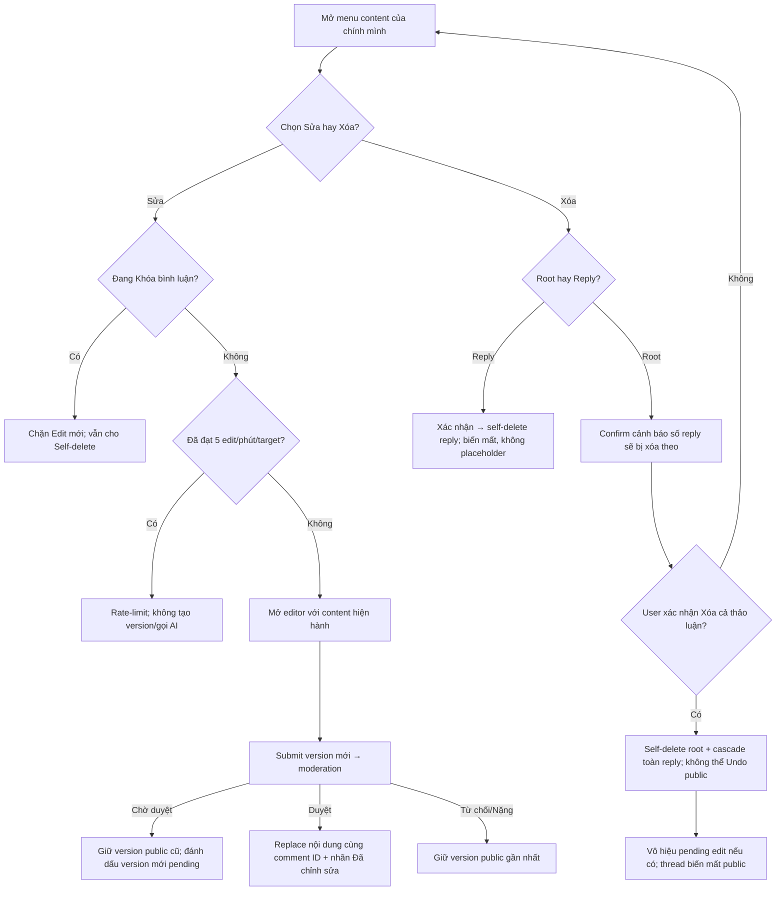
```mermaid
flowchart TD
    A["Mở menu content của chính mình"] --> B{"Chọn Sửa hay Xóa?"}
    B -->|Sửa| C{"Đang Khóa bình luận?"}
    C -->|Có| D["Chặn Edit mới; vẫn cho Self-delete"]
    C -->|Không| E{"Đã đạt 5 edit/phút/target?"}
    E -->|Có| F["Rate-limit; không tạo version/gọi AI"]
    E -->|Không| G["Mở editor với content hiện hành"]
    G --> H["Submit version mới → moderation"]
    H -->|Chờ duyệt| I["Giữ version public cũ; đánh dấu version mới pending"]
    H -->|Duyệt| J["Replace nội dung cùng comment ID + nhãn Đã chỉnh sửa"]
    H -->|Từ chối/Nặng| K["Giữ version public gần nhất"]
    B -->|Xóa| L{"Root hay Reply?"}
    L -->|Reply| M["Xác nhận → self-delete reply; biến mất, không placeholder"]
    L -->|Root| N["Confirm cảnh báo số reply sẽ bị xóa theo"]
    N --> O{"User xác nhận Xóa cả thảo luận?"}
    O -->|Không| A
    O -->|Có| P["Self-delete root + cascade toàn reply; không thể Undo public"]
    P --> Q["Vô hiệu pending edit nếu có; thread biến mất public"]
```

**UX states bắt buộc:** edit pending, edited label, rate-limit, delete reply confirm, destructive root-cascade confirm.  
**Quan trọng:** self-delete root và CMS/Admin delete là hai lifecycle UX khác nhau; không dùng cùng thông điệp “có thể Undo”.

---

## US06 — Bình luận kèm mốc thời gian

**Actor:** User đang xem VOD; người đọc comment có timestamp.

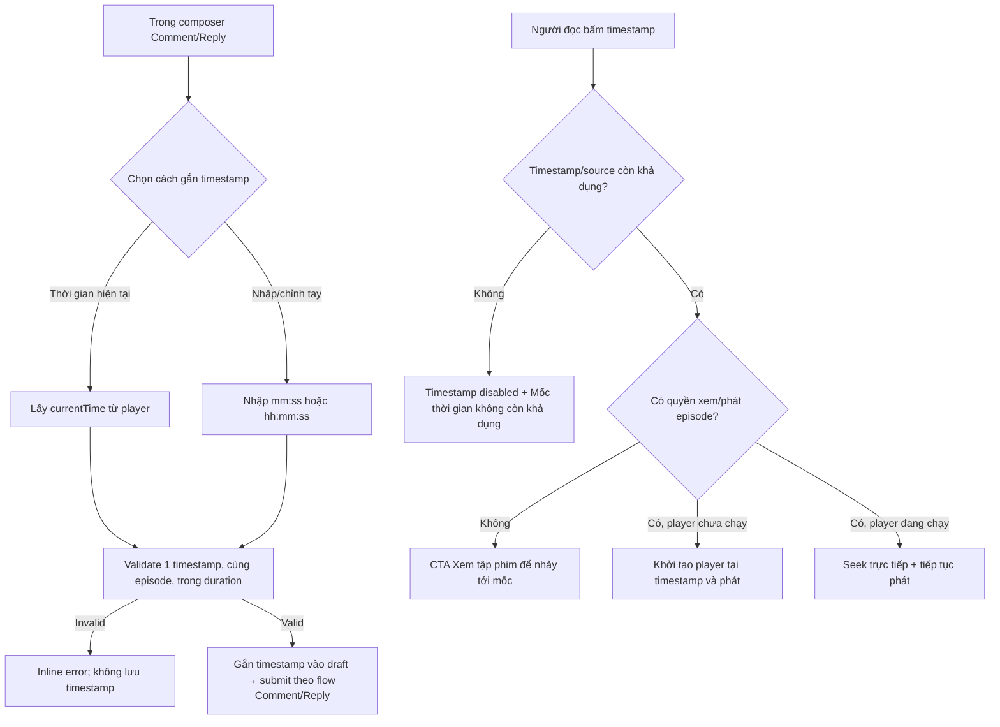
```mermaid
flowchart TD
    A["Trong composer Comment/Reply"] --> B{"Chọn cách gắn timestamp"}
    B -->|Thời gian hiện tại| C["Lấy currentTime từ player"]
    B -->|Nhập/chỉnh tay| D["Nhập mm:ss hoặc hh:mm:ss"]
    C --> E["Validate 1 timestamp, cùng episode, trong duration"]
    D --> E
    E -->|Invalid| F["Inline error; không lưu timestamp"]
    E -->|Valid| G["Gắn timestamp vào draft → submit theo flow Comment/Reply"]
    H["Người đọc bấm timestamp"] --> I{"Timestamp/source còn khả dụng?"}
    I -->|Không| J["Timestamp disabled + Mốc thời gian không còn khả dụng"]
    I -->|Có| K{"Có quyền xem/phát episode?"}
    K -->|Không| L["CTA Xem tập phim để nhảy tới mốc"]
    K -->|Có, player chưa chạy| M["Khởi tạo player tại timestamp và phát"]
    K -->|Có, player đang chạy| N["Seek trực tiếp + tiếp tục phát"]
```

**UX states bắt buộc:** attached timestamp chip/button, invalid format, out-of-range, unavailable, entitlement CTA.  
**A11y:** timestamp là button thật với accessible name “Xem từ phút …”. Share deep link không auto-seek.

---

# EP02 — Tương tác cộng đồng

## US07 — Like và Unlike

**Actor:** User đăng nhập; Guest phải login trước.

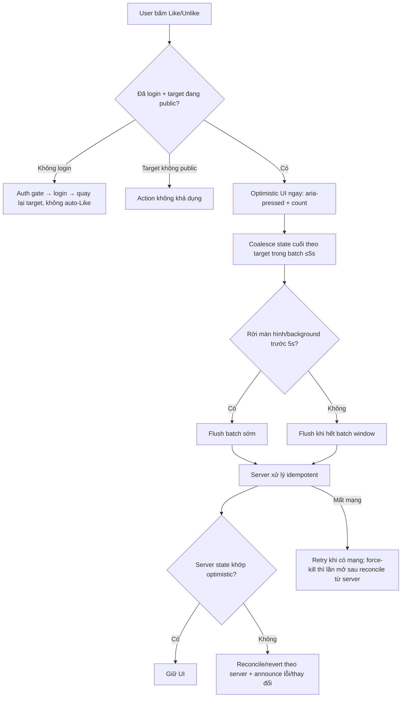
```mermaid
flowchart TD
    A["User bấm Like/Unlike"] --> B{"Đã login + target đang public?"}
    B -->|Không login| C["Auth gate → login → quay lại target, không auto-Like"]
    B -->|Target không public| D["Action không khả dụng"]
    B -->|Có| E["Optimistic UI ngay: aria-pressed + count"]
    E --> F["Coalesce state cuối theo target trong batch ≤5s"]
    F --> G{"Rời màn hình/background trước 5s?"}
    G -->|Có| H["Flush batch sớm"]
    G -->|Không| I["Flush khi hết batch window"]
    H --> J["Server xử lý idempotent"]
    I --> J
    J --> K{"Server state khớp optimistic?"}
    K -->|Có| L["Giữ UI"]
    K -->|Không| M["Reconcile/revert theo server + announce lỗi/thay đổi"]
    J -->|Mất mạng| N["Retry khi có mạng; force-kill thì lần mở sau reconcile từ server"]
```

**UX states bắt buộc:** liked/unliked, pending batch không cần spinner cản trở, reconcile error.  
**A11y:** `aria-pressed`, `aria-live`, reduced-motion.

---

## US08 — Trả lời bình luận một cấp

**Actor:** User đăng nhập.

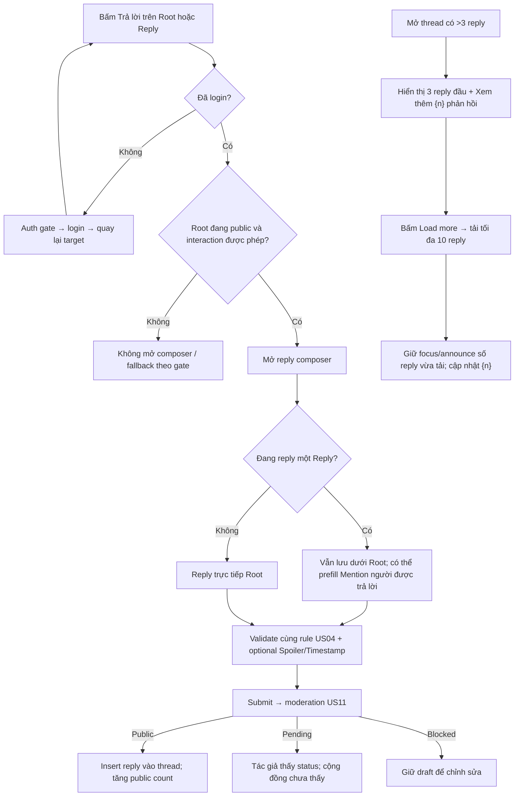
```mermaid
flowchart TD
    A["Bấm Trả lời trên Root hoặc Reply"] --> B{"Đã login?"}
    B -->|Không| C["Auth gate → login → quay lại target"]
    C --> A
    B -->|Có| D{"Root đang public và interaction được phép?"}
    D -->|Không| E["Không mở composer / fallback theo gate"]
    D -->|Có| F["Mở reply composer"]
    F --> G{"Đang reply một Reply?"}
    G -->|Có| H["Vẫn lưu dưới Root; có thể prefill Mention người được trả lời"]
    G -->|Không| I["Reply trực tiếp Root"]
    H --> J["Validate cùng rule US04 + optional Spoiler/Timestamp"]
    I --> J
    J --> K["Submit → moderation US11"]
    K -->|Public| L["Insert reply vào thread; tăng public count"]
    K -->|Pending| M["Tác giả thấy status; cộng đồng chưa thấy"]
    K -->|Blocked| N["Giữ draft để chỉnh sửa"]
    O["Mở thread có >3 reply"] --> P["Hiển thị 3 reply đầu + Xem thêm {n} phản hồi"]
    P --> Q["Bấm Load more → tải tối đa 10 reply"]
    Q --> R["Giữ focus/announce số reply vừa tải; cập nhật {n}"]
```

**UX states bắt buộc:** reply-to-root, reply-to-reply + mention context, pending, load-more, root non-public.  
**Cấu trúc:** depth luôn = 1; không vẽ nested tree sâu hơn.

---

## US09 — Mention và nhận thông báo

**Actor:** User gửi Mention/Reply và User nhận notification.

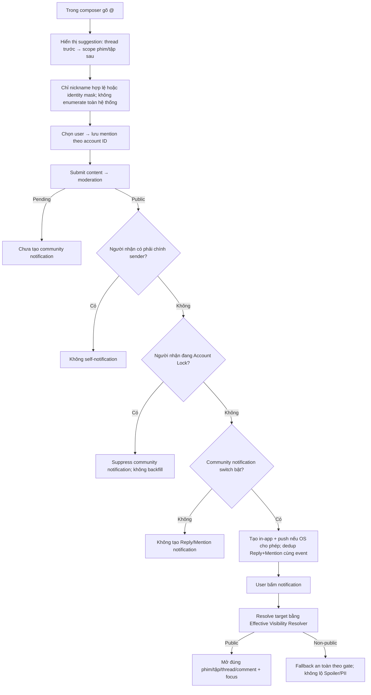
```mermaid
flowchart TD
    A["Trong composer gõ @"] --> B["Hiển thị suggestion: thread trước → scope phim/tập sau"]
    B --> C["Chỉ nickname hợp lệ hoặc identity mask; không enumerate toàn hệ thống"]
    C --> D["Chọn user → lưu mention theo account ID"]
    D --> E["Submit content → moderation"]
    E -->|Pending| F["Chưa tạo community notification"]
    E -->|Public| G{"Người nhận có phải chính sender?"}
    G -->|Có| H["Không self-notification"]
    G -->|Không| I{"Người nhận đang Account Lock?"}
    I -->|Có| J["Suppress community notification; không backfill"]
    I -->|Không| K{"Community notification switch bật?"}
    K -->|Không| L["Không tạo Reply/Mention notification"]
    K -->|Có| M["Tạo in-app + push nếu OS cho phép; dedup Reply+Mention cùng event"]
    M --> N["User bấm notification"]
    N --> O["Resolve target bằng Effective Visibility Resolver"]
    O -->|Public| P["Mở đúng phim/tập/thread/comment + focus"]
    O -->|Non-public| Q["Fallback an toàn theo gate; không lộ Spoiler/PII"]
```

**Luồng bắt buộc riêng:** Cảnh báo/moderation/sanction/appeal/Report-result **không đi qua community switch**.  
**Account Lock:** login → locked-account screen → status + reason + **1800 1166 (miễn phí, 24/7)**.

---

# EP03 — An toàn và kiểm duyệt

## US10 — Report bình luận vi phạm

**Actor:** User đăng nhập.

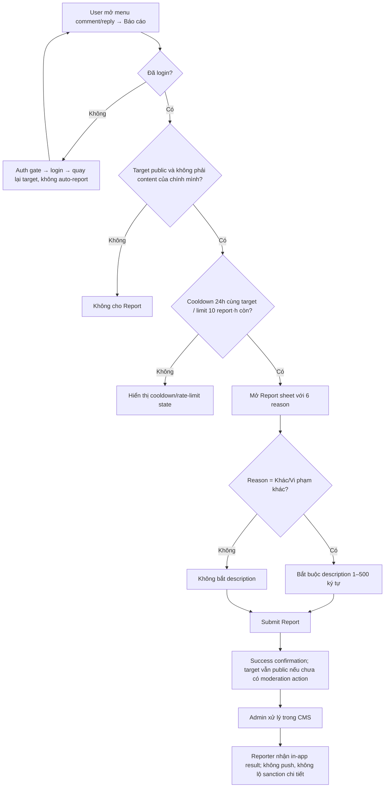
```mermaid
flowchart TD
    A["User mở menu comment/reply → Báo cáo"] --> B{"Đã login?"}
    B -->|Không| C["Auth gate → login → quay lại target, không auto-report"]
    C --> A
    B -->|Có| D{"Target public và không phải content của chính mình?"}
    D -->|Không| E["Không cho Report"]
    D -->|Có| F{"Cooldown 24h cùng target / limit 10 report·h còn?"}
    F -->|Không| G["Hiển thị cooldown/rate-limit state"]
    F -->|Có| H["Mở Report sheet với 6 reason"]
    H --> I{"Reason = Khác/Vi phạm khác?"}
    I -->|Có| J["Bắt buộc description 1–500 ký tự"]
    I -->|Không| K["Không bắt description"]
    J --> L["Submit Report"]
    K --> L
    L --> M["Success confirmation; target vẫn public nếu chưa có moderation action"]
    M --> N["Admin xử lý trong CMS"]
    N --> O["Reporter nhận in-app result; không push, không lộ sanction chi tiết"]
```

**UX states bắt buộc:** reason selection, Other description counter/error, cooldown, hourly rate-limit, success confirmation.

---

## US11 — AI kiểm duyệt theo hai chế độ

**Actor:** Admin vận hành + System; tác động tới User submit content.

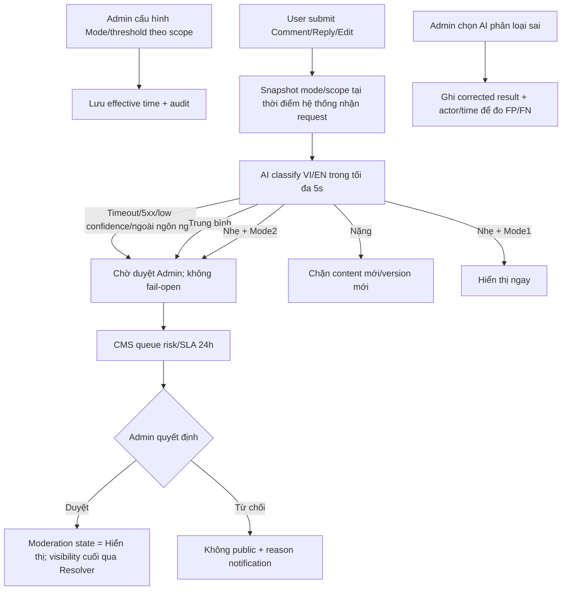
```mermaid
flowchart TD
    A["Admin cấu hình Mode/threshold theo scope"] --> B["Lưu effective time + audit"]
    C["User submit Comment/Reply/Edit"] --> D["Snapshot mode/scope tại thời điểm hệ thống nhận request"]
    D --> E["AI classify VI/EN trong tối đa 5s"]
    E -->|Timeout/5xx/low confidence/ngoài ngôn ngữ| F["Chờ duyệt Admin; không fail-open"]
    E -->|Nặng| G["Chặn content mới/version mới"]
    E -->|Trung bình| F
    E -->|Nhẹ + Mode1| H["Hiển thị ngay"]
    E -->|Nhẹ + Mode2| F
    F --> I["CMS queue risk/SLA 24h"]
    I --> J{"Admin quyết định"}
    J -->|Duyệt| K["Moderation state = Hiển thị; visibility cuối qua Resolver"]
    J -->|Từ chối| L["Không public + reason notification"]
    M["Admin chọn AI phân loại sai"] --> N["Ghi corrected result + actor/time để đo FP/FN"]
```

**Nickname là flow riêng:** global policy, không inherit Mode1/2. Nhẹ/An toàn → dùng ngay; Trung bình/Nặng → chặn ngay. Repo hiện có wording timeout nickname chưa đồng nhất; theo `SOLUTION_ARCHITECTURE.md`, UX **không public/không đổi nickname mới khi chưa có AI decision hợp lệ**, giữ nickname cũ/fallback cho tới khi technical refinement normalize rule.

---

## US12 — Quản lý trạng thái và phạm vi hiển thị

**Actor:** Admin vận hành; User chịu ảnh hưởng khi đọc/tương tác.

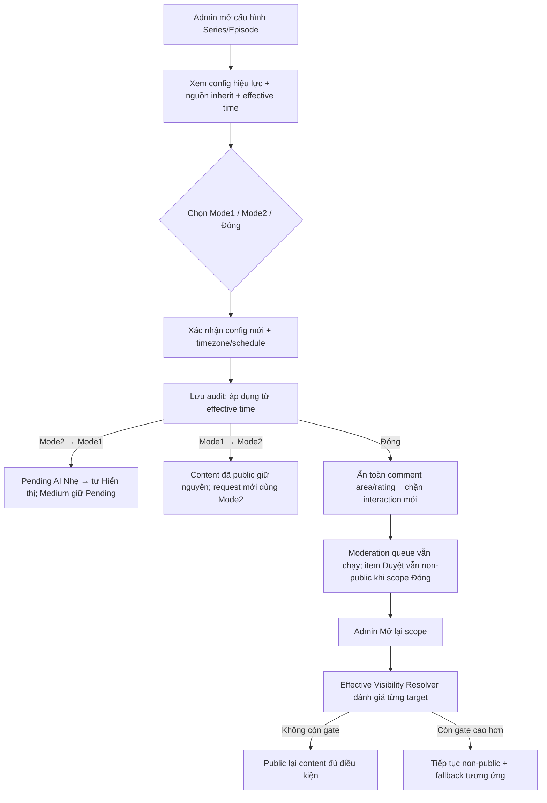
```mermaid
flowchart TD
    A["Admin mở cấu hình Series/Episode"] --> B["Xem config hiệu lực + nguồn inherit + effective time"]
    B --> C{"Chọn Mode1 / Mode2 / Đóng"}
    C --> D["Xác nhận config mới + timezone/schedule"]
    D --> E["Lưu audit; áp dụng từ effective time"]
    E -->|Mode2 → Mode1| F["Pending AI Nhẹ → tự Hiển thị; Medium giữ Pending"]
    E -->|Mode1 → Mode2| G["Content đã public giữ nguyên; request mới dùng Mode2"]
    E -->|Đóng| H["Ẩn toàn comment area/rating + chặn interaction mới"]
    H --> I["Moderation queue vẫn chạy; item Duyệt vẫn non-public khi scope Đóng"]
    I --> J["Admin Mở lại scope"]
    J --> K["Effective Visibility Resolver đánh giá từng target"]
    K -->|Không còn gate| L["Public lại content đủ điều kiện"]
    K -->|Còn gate cao hơn| M["Tiếp tục non-public + fallback tương ứng"]
```

**UX rule của Resolver:** Self-delete → moderation riêng → Admin root cascade → Account Lock → scope Đóng. Chỉ hiển thị **một** fallback có ưu tiên cao nhất; không ghi đè state của gate khác.

---

# EP04 — CMS quản trị bình luận

## US13 — Tra cứu bình luận trên CMS

**Actor:** Admin/Moderator theo scope được cấp.

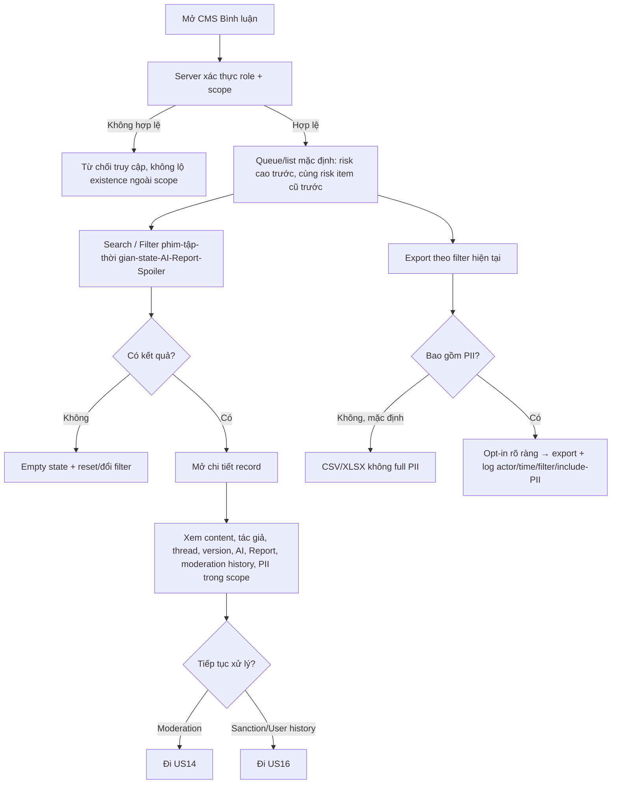
```mermaid
flowchart TD
    A["Mở CMS Bình luận"] --> B["Server xác thực role + scope"]
    B -->|Không hợp lệ| C["Từ chối truy cập, không lộ existence ngoài scope"]
    B -->|Hợp lệ| D["Queue/list mặc định: risk cao trước, cùng risk item cũ trước"]
    D --> E["Search / Filter phim-tập-thời gian-state-AI-Report-Spoiler"]
    E --> F{"Có kết quả?"}
    F -->|Không| G["Empty state + reset/đổi filter"]
    F -->|Có| H["Mở chi tiết record"]
    H --> I["Xem content, tác giả, thread, version, AI, Report, moderation history, PII trong scope"]
    I --> J{"Tiếp tục xử lý?"}
    J -->|Moderation| K["Đi US14"]
    J -->|Sanction/User history| L["Đi US16"]
    D --> M["Export theo filter hiện tại"]
    M --> N{"Bao gồm PII?"}
    N -->|Không, mặc định| O["CSV/XLSX không full PII"]
    N -->|Có| P["Opt-in rõ ràng → export + log actor/time/filter/include-PII"]
```

**UX states bắt buộc:** queue SLA badge, no-results, loading/error, export progress/error.  
**Security UX:** không phân biệt lỗi “không tồn tại” và “ngoài scope” theo cách tạo oracle dữ liệu.

---

## US14 — Xử lý nội dung trên CMS

**Actor:** Admin/Moderator có quyền.

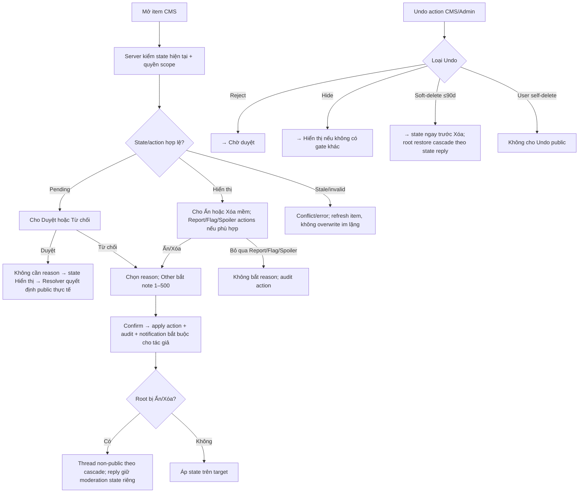
```mermaid
flowchart TD
    A["Mở item CMS"] --> B["Server kiểm state hiện tại + quyền scope"]
    B --> C{"State/action hợp lệ?"}
    C -->|Pending| D["Cho Duyệt hoặc Từ chối"]
    C -->|Hiển thị| E["Cho Ẩn hoặc Xóa mềm; Report/Flag/Spoiler actions nếu phù hợp"]
    C -->|Stale/invalid| F["Conflict/error; refresh item, không overwrite im lặng"]
    D -->|Duyệt| G["Không cần reason → state Hiển thị → Resolver quyết định public thực tế"]
    D -->|Từ chối| H["Chọn reason; Other bắt note 1–500"]
    E -->|Ẩn/Xóa| H
    E -->|Bỏ qua Report/Flag/Spoiler| I["Không bắt reason; audit action"]
    H --> J["Confirm → apply action + audit + notification bắt buộc cho tác giả"]
    J --> K{"Root bị Ẩn/Xóa?"}
    K -->|Có| L["Thread non-public theo cascade; reply giữ moderation state riêng"]
    K -->|Không| M["Áp state trên target"]
    N["Undo action CMS/Admin"] --> O{"Loại Undo"}
    O -->|Reject| P["→ Chờ duyệt"]
    O -->|Hide| Q["→ Hiển thị nếu không có gate khác"]
    O -->|Soft-delete ≤90d| R["→ state ngay trước Xóa; root restore cascade theo state reply"]
    O -->|User self-delete| S["Không cho Undo public"]
```

**Bulk flow:** chọn tối đa 100 item → action chỉ `Duyệt/Từ chối/Ẩn/Xóa mềm` → validate từng item → partial success → summary item thành công/thất bại; không báo success toàn bộ nếu có lỗi.  
**UX quan trọng:** destructive action phải có confirmation; “Vi phạm khác” có counter/validation 1–500.

---

## US15 — Ghim bình luận và cấu hình theo phim

**Actor:** Admin vận hành nội dung.

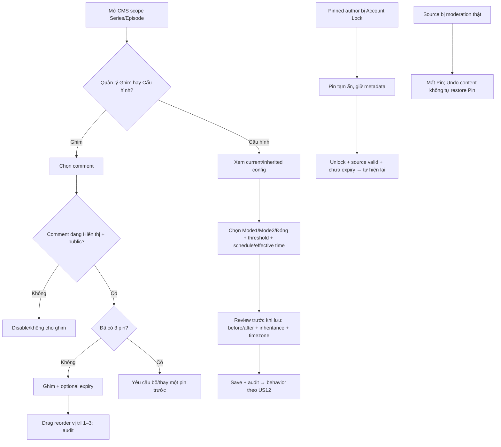
```mermaid
flowchart TD
    A["Mở CMS scope Series/Episode"] --> B{"Quản lý Ghim hay Cấu hình?"}
    B -->|Ghim| C["Chọn comment"]
    C --> D{"Comment đang Hiển thị + public?"}
    D -->|Không| E["Disable/không cho ghim"]
    D -->|Có| F{"Đã có 3 pin?"}
    F -->|Không| G["Ghim + optional expiry"]
    F -->|Có| H["Yêu cầu bỏ/thay một pin trước"]
    G --> I["Drag reorder vị trí 1–3; audit"]
    B -->|Cấu hình| J["Xem current/inherited config"]
    J --> K["Chọn Mode1/Mode2/Đóng + threshold + schedule/effective time"]
    K --> L["Review trước khi lưu: before/after + inheritance + timezone"]
    L --> M["Save + audit → behavior theo US12"]
    N["Pinned author bị Account Lock"] --> O["Pin tạm ẩn, giữ metadata"]
    O --> P["Unlock + source valid + chưa expiry → tự hiện lại"]
    Q["Source bị moderation thật"] --> R["Mất Pin; Undo content không tự restore Pin"]
```

**UX states bắt buộc:** pin capacity 3/3, replace/unpin, expiry picker, reorder affordance, inherited vs overridden config rõ ràng.

---

## US16 — Quản lý người dùng vi phạm và Audit

**Actor:** Admin/Moderator; User bị sanction; Support/CSKH cho Account Lock appeal.

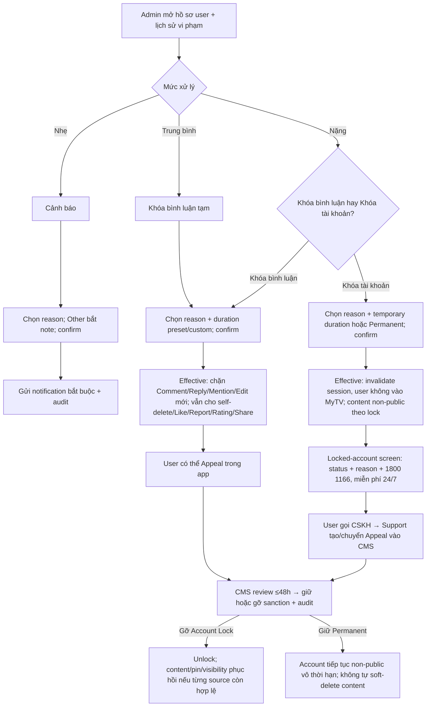
```mermaid
flowchart TD
    A["Admin mở hồ sơ user + lịch sử vi phạm"] --> B{"Mức xử lý"}
    B -->|Nhẹ| C["Cảnh báo"]
    B -->|Trung bình| D["Khóa bình luận tạm"]
    B -->|Nặng| E{"Khóa bình luận hay Khóa tài khoản?"}
    C --> F["Chọn reason; Other bắt note; confirm"]
    D --> G["Chọn reason + duration preset/custom; confirm"]
    E -->|Khóa bình luận| G
    E -->|Khóa tài khoản| H["Chọn reason + temporary duration hoặc Permanent; confirm"]
    F --> I["Gửi notification bắt buộc + audit"]
    G --> J["Effective: chặn Comment/Reply/Mention/Edit mới; vẫn cho self-delete/Like/Report/Rating/Share"]
    J --> K["User có thể Appeal trong app"]
    K --> L["CMS review ≤48h → giữ hoặc gỡ sanction + audit"]
    H --> M["Effective: invalidate session, user không vào MyTV; content non-public theo lock"]
    M --> N["Locked-account screen: status + reason + 1800 1166, miễn phí 24/7"]
    N --> O["User gọi CSKH → Support tạo/chuyển Appeal vào CMS"]
    O --> L
    L -->|Gỡ Account Lock| P["Unlock; content/pin/visibility phục hồi nếu từng source còn hợp lệ"]
    L -->|Giữ Permanent| Q["Account tiếp tục non-public vô thời hạn; không tự soft-delete content"]
```

**UX states bắt buộc:** sanction confirmation, duration picker, mandatory reason, Other note, Comment Lock banner/status, locked-account full-screen, appeal status + overdue SLA.  
**Security:** Account Lock phải invalidate session ngay effective time.

---

# EP05 — Tăng trưởng và phân tích

## US17 — Huy hiệu người dùng

**Actor:** User; Admin cho badge thủ công; System daily job.

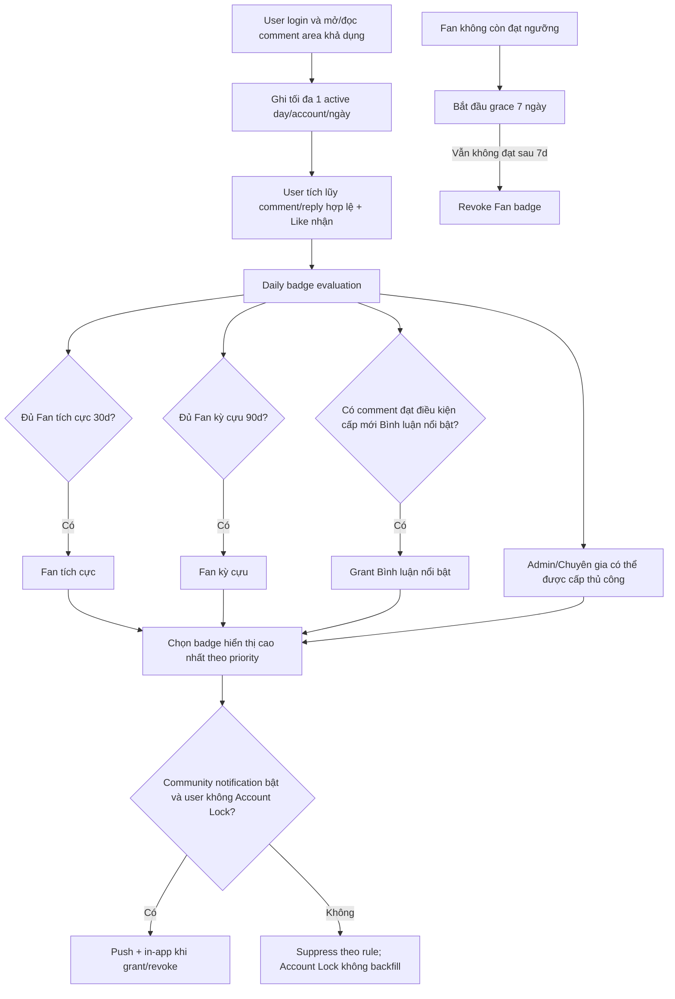
```mermaid
flowchart TD
    A["User login và mở/đọc comment area khả dụng"] --> B["Ghi tối đa 1 active day/account/ngày"]
    B --> C["User tích lũy comment/reply hợp lệ + Like nhận"]
    C --> D["Daily badge evaluation"]
    D --> E{"Đủ Fan tích cực 30d?"}
    E -->|Có| F["Fan tích cực"]
    D --> G{"Đủ Fan kỳ cựu 90d?"}
    G -->|Có| H["Fan kỳ cựu"]
    D --> I{"Có comment đạt điều kiện cấp mới Bình luận nổi bật?"}
    I -->|Có| J["Grant Bình luận nổi bật"]
    D --> K["Admin/Chuyên gia có thể được cấp thủ công"]
    F --> L["Chọn badge hiển thị cao nhất theo priority"]
    H --> L
    J --> L
    K --> L
    L --> M{"Community notification bật và user không Account Lock?"}
    M -->|Có| N["Push + in-app khi grant/revoke"]
    M -->|Không| O["Suppress theo rule; Account Lock không backfill"]
    P["Fan không còn đạt ngưỡng"] --> Q["Bắt đầu grace 7 ngày"]
    Q -->|Vẫn không đạt sau 7d| R["Revoke Fan badge"]
```

**Special UX semantics:** Account Lock không hồi tố xoá Fan contribution hợp lệ; Featured badge chỉ tạm ẩn khi source non-public do Account Lock. Self-delete root cascade làm reply/Like cascade không còn hợp lệ.  
**A11y:** badge icon luôn có text alternative như “Huy hiệu Fan kỳ cựu”.

---

## US18 — Chia sẻ bình luận

**Actor:** User gửi share; người nhận có thể Guest.

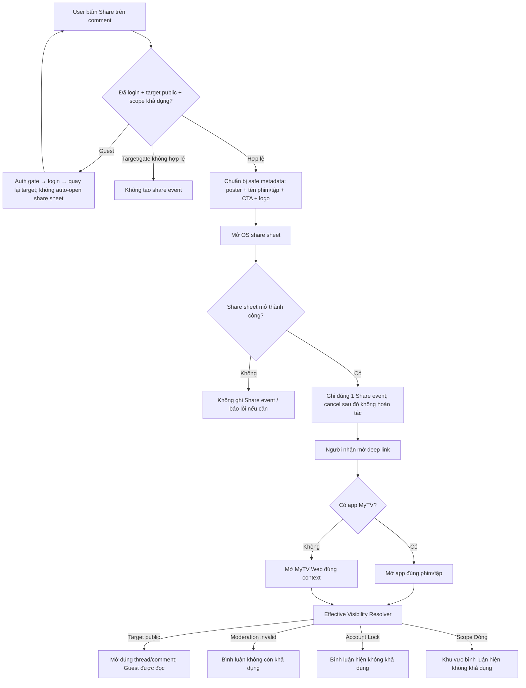
```mermaid
flowchart TD
    A["User bấm Share trên comment"] --> B{"Đã login + target public + scope khả dụng?"}
    B -->|Guest| C["Auth gate → login → quay lại target; không auto-open share sheet"]
    C --> A
    B -->|Target/gate không hợp lệ| D["Không tạo share event"]
    B -->|Hợp lệ| E["Chuẩn bị safe metadata: poster + tên phim/tập + CTA + logo"]
    E --> F["Mở OS share sheet"]
    F --> G{"Share sheet mở thành công?"}
    G -->|Không| H["Không ghi Share event / báo lỗi nếu cần"]
    G -->|Có| I["Ghi đúng 1 Share event; cancel sau đó không hoàn tác"]
    I --> J["Người nhận mở deep link"]
    J --> K{"Có app MyTV?"}
    K -->|Có| L["Mở app đúng phim/tập"]
    K -->|Không| M["Mở MyTV Web đúng context"]
    L --> N["Effective Visibility Resolver"]
    M --> N
    N -->|Target public| O["Mở đúng thread/comment; Guest được đọc"]
    N -->|Moderation invalid| P["Bình luận không còn khả dụng"]
    N -->|Account Lock| Q["Bình luận hiện không khả dụng"]
    N -->|Scope Đóng| R["Khu vực bình luận hiện không khả dụng"]
```

**Privacy:** payload/preview không chứa nguyên văn comment, nickname/phone hoặc Spoiler.  
**Timestamp:** mở đúng comment nhưng **không auto-seek**.

---

## US19 — Thống kê hoạt động bình luận

**Actor:** Product Manager/Admin vận hành.

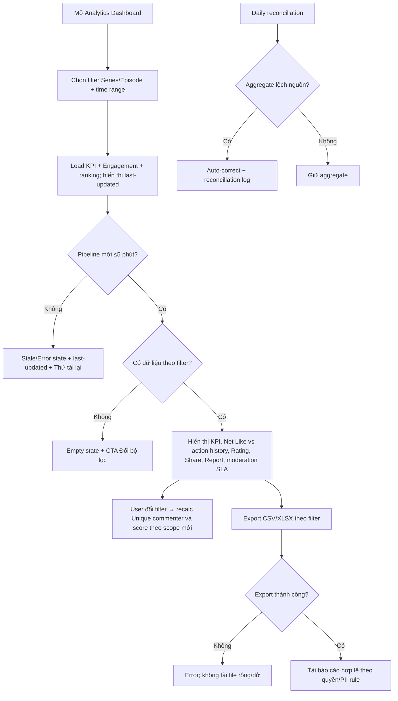
```mermaid
flowchart TD
    A["Mở Analytics Dashboard"] --> B["Chọn filter Series/Episode + time range"]
    B --> C["Load KPI + Engagement + ranking; hiển thị last-updated"]
    C --> D{"Pipeline mới ≤5 phút?"}
    D -->|Không| E["Stale/Error state + last-updated + Thử tải lại"]
    D -->|Có| F{"Có dữ liệu theo filter?"}
    F -->|Không| G["Empty state + CTA Đổi bộ lọc"]
    F -->|Có| H["Hiển thị KPI, Net Like vs action history, Rating, Share, Report, moderation SLA"]
    H --> I["User đổi filter → recalc Unique commenter và score theo scope mới"]
    H --> J["Export CSV/XLSX theo filter"]
    J --> K{"Export thành công?"}
    K -->|Không| L["Error; không tải file rỗng/dở"]
    K -->|Có| M["Tải báo cáo hợp lệ theo quyền/PII rule"]
    N["Daily reconciliation"] --> O{"Aggregate lệch nguồn?"}
    O -->|Có| P["Auto-correct + reconciliation log"]
    O -->|Không| Q["Giữ aggregate"]
```

**Data UX:** scope Đóng **không làm KPI tụt**; Account Lock/moderation/lifecycle có thể làm public KPI điều chỉnh. UI không nên dùng cùng một label “ẩn” cho mọi nguyên nhân.

---

## US20 — AI hỗ trợ vận hành cộng đồng

**Actor:** Admin/Biên tập viên có quyền trong scope hiện tại.

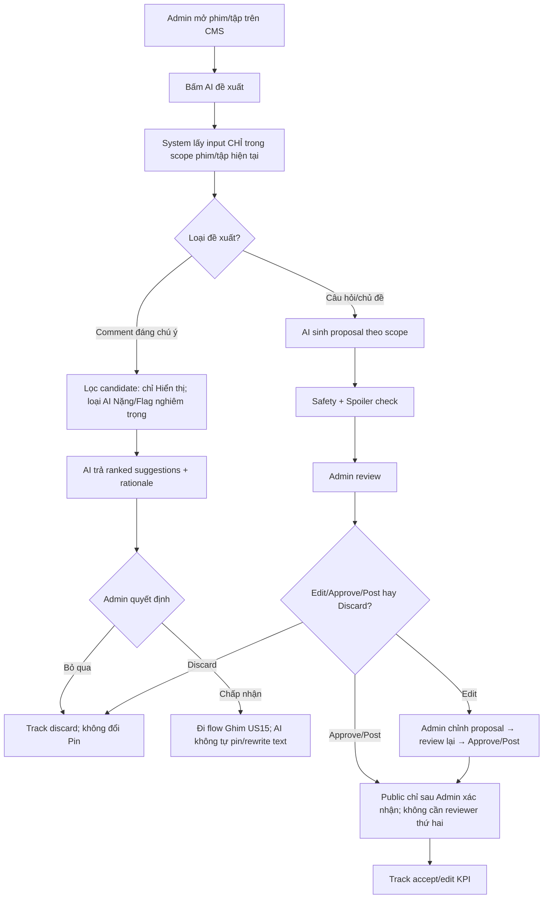
```mermaid
flowchart TD
    A["Admin mở phim/tập trên CMS"] --> B["Bấm AI đề xuất"]
    B --> C["System lấy input CHỈ trong scope phim/tập hiện tại"]
    C --> D{"Loại đề xuất?"}
    D -->|Comment đáng chú ý| E["Lọc candidate: chỉ Hiển thị; loại AI Nặng/Flag nghiêm trọng"]
    E --> F["AI trả ranked suggestions + rationale"]
    F --> G{"Admin quyết định"}
    G -->|Bỏ qua| H["Track discard; không đổi Pin"]
    G -->|Chấp nhận| I["Đi flow Ghim US15; AI không tự pin/rewrite text"]
    D -->|Câu hỏi/chủ đề| J["AI sinh proposal theo scope"]
    J --> K["Safety + Spoiler check"]
    K --> L["Admin review"]
    L --> M{"Edit/Approve/Post hay Discard?"}
    M -->|Edit| N["Admin chỉnh proposal → review lại → Approve/Post"]
    M -->|Approve/Post| O["Public chỉ sau Admin xác nhận; không cần reviewer thứ hai"]
    M -->|Discard| H
    N --> O
    O --> P["Track accept/edit KPI"]
```

**Guardrail UX:** không có auto-run, auto-pin, auto-publish hoặc quality-based auto-disable. Report chưa xác minh chỉ là tín hiệu tham khảo, không tự loại candidate.

---

# 21. Screen/State inventory đề xuất cho wireframe

Đây là **inventory để Design triển khai**, không phải business rule mới:

1. Comment Area — loading / empty guest / empty logged-in / populated / closed.
2. Series–Episode context control.
3. Sort control + Pin group + root pagination/lazy load.
4. Rating 5-star component + existing-rating state.
5. Comment/Reply composer + Spoiler + Timestamp + validation.
6. Nickname create/change + quota/error/fallback identity.
7. Pending moderation state của tác giả.
8. Comment action menu — Edit/Delete/Report/Share.
9. Reply thread + `Xem thêm {n} phản hồi`.
10. Report sheet + reason/Other description.
11. Notification center + deep-link fallback states.
12. Comment Lock status/banner + in-app appeal entry.
13. Account Lock full-screen + hotline/appeal instruction.
14. CMS moderation queue/list/filter/detail.
15. CMS single moderation + bulk moderation result.
16. CMS Pin/configuration/inheritance/schedule.
17. CMS user violation history + sanction + appeal.
18. Badge display + badge notification.
19. Share/deep-link fallback states.
20. Analytics dashboard + empty/stale/export states.
21. AI Ops suggestion/review flow.

---

# 22. Các Design Decision chưa được backlog chốt

Các mục dưới đây **không phải blocker PO/business**, nhưng UX/UI cần quyết định trước khi high-fidelity/handoff:

1. Vị trí chính xác của khu vực Bình luận trên trang chi tiết/xem phim ở web/mobile.
2. Pattern chuyển **Series ↔ Episode**: tab, segmented control, dropdown hay context tự động.
3. Quy tắc rút gọn comment dài: số dòng trước “Xem thêm”, hành vi collapse sau khi expand.
4. Pattern hiển thị `Pending` cho chính tác giả trong list: inline item, chip status hay khu riêng.
5. IA của CMS: tách Queue / Search / User history / Config thành navigation như thế nào.
6. Pattern bulk-selection trên CMS cho desktop/tablet.
7. Trường nhập cụ thể của **Appeal Khóa bình luận** trong app (backlog chỉ chốt kênh, SLA và outcome).
8. Visual language của badge, Pin, Spoiler và moderation status — phải tuân WCAG, không chỉ dựa màu.

---

# 23. UX issue cần technical refinement

**Nickname AI timeout**: `US11` hiện đồng thời ghi “nickname không có trạng thái Chờ duyệt” nhưng AC/Test timeout chung lại nói `content/nickname → Chờ duyệt`. `SOLUTION_ARCHITECTURE.md` đã chọn invariant an toàn: **khi AI chưa có decision hợp lệ thì nickname mới không được đổi/public; giữ nickname cũ/fallback**. User flow US04/US11 trong tài liệu này bám invariant đó nhưng cần Dev/PO normalize wording US11 trước khi API contract được khóa.

---

## Handoff note

Các flow Mermaid trong file này nên được dùng làm **source-of-truth cho flow logic** khi dựng wireframe/Figma. UI có thể thay đổi component/layout nhưng không được bỏ các decision branch về auth, moderation, visibility gate, sanction, retention/Undo hoặc error state đã thể hiện ở đây.
